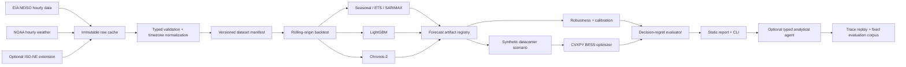

ocated in Cambridge and Niskayuna; Cambridge hires complete a three-month ARC residency. [S08][S09] | Hiring managers not disclosed | Governed agents, typed tools, tracing, evaluation, deployment |
| **Advanced Research Center, Frontier Campus, Niskayuna** | **[Verified fact]** ARC conducts applied energy R&D/testing; the expanded campus opened in July 2026 after more than $110M combined investment and is expected to support 75 research positions. GE Vernova reports 150+ projects, 420+ partners, and 250+ researchers. [S19][S21] | Dave Vernooy; Philip Hart; Masoud Abbaszadeh [S19][S45][S46] | TSFM, controls, power systems, industrial AI, simulation/test, technical validation |
| **Power Conversion & Storage** | **[Verified fact]** Live roles cover datacenter inverters, BESS, HIL, controls, battery technology, sizing, and engineering AI tools in Niskayuna and Findlay Township. [S01]–[S05] | Hiring managers not disclosed | Strongest undergraduate-accessible bridge to datacenter/storage work |
| **Grid Software / GridOS** | **[Verified fact]** Current material covers unified grid context, forecasting/stability, distribution data integration, network-model diagnostics, GIS/SCADA/EMS, and LLM-assisted remediation. [S06][S23][S24] | Role-level decision owners not disclosed | Data consistency, provenance, safe fallbacks, bounded agents |
| **MIT–GE Vernova Alliance** | **[Verified fact]** The $50M/five-year program includes research, fellowships, internships, recruiting, datacenter converters, AI grid solvers, grid-forming controls, physics-aware foundation models, and optimization. [S26][S27] | Joint institutional program | Verifies Cambridge’s university-facing research/talent ecosystem; does not create a BU connection |
| **BU-facing routes** | **[Verified fact]** Philip Hart has a BU CISE profile; Hanna Tischer appeared on a BU ENERGIZE industry panel. [S45][S47] | Philip Hart; Hanna Tischer | Plausible technical/institutional routing, not proof of a personal connection |

### 3.2 Cross-site relationship

```text
Cambridge HQ / Market Intelligence / enterprise AI
              │
              │ joint Cambridge–Niskayuna roles
              │ required ARC immersion for Cambridge senior AI hires
              ▼
Niskayuna ARC / PCS laboratories / applied test capability
              │
              ├── applied and foundational AI/time-series research
              ├── power systems, controls, cyber-physical resilience
              ├── datacenter power conversion and physical testing
              └── interfaces to GE Vernova business product teams
```

- **[Verified fact]** At least two senior AI roles formally bridge Cambridge and Niskayuna and require technical grounding at ARC. [S08][S09]
- **[Verified fact]** The Niskayuna Battery internship interfaces with ARC testing; the PCS AI-tool internship interfaces with AI Research Technology. [S02][S03]
- **[Strong inference]** Cambridge more likely concentrates headquarters, market/customer, portfolio, and product-coordination work, while Niskayuna concentrates applied research, laboratory validation, and foundational technical work. This is not an official published division of labor. [S07]–[S09][S19][S22]
- **[Strong inference]** A Boston-based undergraduate can contribute to a Niskayuna-led software/data project, but hardware roles require Niskayuna presence and lab work. [S01][S03]
- **[Not publicly knowable]** Whether internships share one recruiting pipeline, how frequently staff rotate beyond published residency, or whether teams share internal code/models/datasets.

### 3.3 Cambridge ecosystem

- **[Verified fact]** The MIT alliance explicitly includes internships and recruiting and funds projects closely related to datacenter power, grid AI, foundation models, and energy optimization. [S26][S27]
- **[Verified fact]** GE Vernova joined Greentown Labs as a Terawatt Partner in 2023. [S28]
- **[Strong inference]** These relationships make Cambridge effective for customer/problem discovery and technical visibility, but they do not establish access for Giacomo.
- **[Tentative hypothesis]** BU’s differentiated route is an independent public New England benchmark reviewed by BU-based power-systems and ML validators, not an attempted imitation of proprietary or MIT-sponsored work.

---

## 4. Current GE Vernova technical-priority map

| Domain | Evidence-backed priority | Principal groups | Artifact implication | State |
|---|---|---|---|---|
| **Market intelligence** | Modernize spreadsheet forecasting into transparent, scalable platforms; parameterize expert assumptions; synthesize external power-market evidence; make outputs decision-ready | Market Intelligence | Versioned data, scenario definitions, provenance, and explainable result packets are mandatory | **[Verified fact]** [S07] |
| **Demand, generation, and price forecasting** | Demand/supply/capacity/dispatch and structural-shift scenarios are explicit current requirements; historical Cambridge intern scope included demand/price/generation forecasting | Market Intelligence; historical MCI | Use strong baselines, rolling origins, event-specific errors, and explicit assumptions | **[Verified fact]** for current agenda; **[Strong inference]** for historical recurrence [S07][S10]–[S12] |
| **Time-series foundation models** | A named 2026 Niskayuna internship evaluated TSFMs on turbines/grids; current ARC/AI investment sustains the problem area | ARC AI/ML and domain teams | Compare TSFMs against strong specialized models under shift; publish negative results | **[Strong inference]** [S15]–[S21] |
| **Agentic AI** | Historical Agentic Engineering used LangGraph/MCP/retrieval/evaluation; current PCS and GridOS roles build agents for engineering data/remediation; senior roles emphasize reusable frameworks and verification | ARC AI, enterprise AI, PCS, Grid Software | Agent must call deterministic typed tools, preserve lineage, recover, and abstain | **[Verified fact]** for current adjacent work; **[Strong inference]** for exact internship recurrence [S03][S06][S08][S09][S13][S14] |
| **Sustainability / emissions** | Historical role and public products use optimization and sustainability data | Enterprise AI, Market Intelligence, product teams | Emissions should be optional and method-explicit, not the headline result | **[Strong inference]** [S18][S34][S35] |
| **Grid automation / software** | GridOS addresses fragmented systems, siloed data, interoperability, network-model diagnostics, and operator-first AI | Grid Software / Grid Solutions | Data consistency, legacy integration, human review, explainability, and auditability are central | **[Verified fact]** [S06][S23][S24] |
| **Datacenter applications** | Live roles and ARC demonstrations target inverters, BESS, controls, HIL, and abrupt high-density AI loads | PCS, ARC | Use synthetic load and constrained storage decisions; exclude interconnection/protection/hardware claims | **[Verified fact]** [S01][S02][S04][S22] |
| **Storage / controls** | BESS sizing/configuration, battery technology, inverter controls, and real-time validation are current hiring themes | PCS, ARC | Explicit SOC, efficiency, power/energy, reserve, and solver constraints are required | **[Verified fact]** [S01][S02][S04][S05] |
| **Industrial AI verification** | Current AI and GridOS roles emphasize technical rigor, success metrics, explainability, and operational value | Enterprise AI, ARC, Grid Software | Fixed evaluation corpus, numerical consistency, trace replay, and source coverage are first-class | **[Verified fact]** [S06][S09] |

**[Strong inference]** The common denominator is reliable analytical translation:

```text
messy or revised data
→ explicit temporal and engineering contracts
→ robust numerical model
→ constrained scenario or decision
→ governed explanation with provenance
→ human-verifiable result
```

---

## 5. Evidenced technical problem hypotheses

### 5.1 Forecast ranking changes during events or regime shifts

- **Evidence:** **[Verified fact]** Current forecasting work explicitly targets market disruptions and structural shifts; GridOS material addresses fast-changing demand and operating conditions. [S07][S23]
- **Affected groups:** Market Intelligence, ARC time-series research, Grid Software.
- **Likely technical owner:** **[Not publicly knowable]** R5044308’s team and public TSFM researcher Masoud Abbaszadeh are the clearest signals.
- **Impact:** A model selected on aggregate error may fail during heat/cold, scarcity, or altered load shape when errors matter most.
- **Public environment:** EIA NEISO load/forecast plus NOAA weather. [S29][S33]
- **Existing approaches:** Seasonal baselines, ETS/SARIMAX, boosted trees, neural forecasters, TSFMs, quantile/conformal methods.
- **Unresolved point:** Public benchmarks rarely connect event-conditioned model rank to a constrained decision.
- **Undergraduate feasibility:** High.
- **Confidence:** **High strong inference**.

### 5.2 Missing or delayed exogenous data silently degrades forecasts

- **Evidence:** **[Verified fact]** Current GE forecasting and GridOS roles emphasize standardized data, governance, diagnostics, and model consistency. [S06][S07][S24]
- **Affected groups:** Market Intelligence, Grid Software, enterprise AI.
- **Impact:** Weather or telemetry delay can produce plausible but stale forecasts and materially worse downstream decisions.
- **Public environment:** Seeded corruption of NOAA weather and EIA load.
- **Existing approaches:** Imputation, missingness indicators, robust training, fallbacks, conformal recalibration.
- **Unresolved point:** Clean-set model comparisons often omit decision propagation.
- **Feasibility:** High.
- **Confidence:** **High strong inference**.

### 5.3 Prediction intervals lose calibration during extremes

- **Evidence:** **[Verified fact]** Forecasting outputs must be trustworthy and decision-ready; ISO-NE’s BTM BESS forecast discusses peak-timing uncertainty and dispatch-miss risk. [S07][S32]
- **Affected groups:** Market Intelligence, ARC forecasting, PCS applications.
- **Impact:** Under-covering intervals can drive aggressive dispatch, reserve depletion, or understated commercial risk.
- **Public environment:** Native TSFM quantiles plus past-only conformal calibration.
- **Unresolved point:** Overall coverage can conceal event-conditional failure.
- **Feasibility:** Medium-high; sample size must be reported.
- **Confidence:** **High strong inference**.

### 5.4 TSFM gains may not justify compute, latency, or adaptation cost

- **Evidence:** **[Strong inference]** GE Vernova recruited a 2026 TSFM intern, while current open models differ materially in size, covariate support, and support status. [S15][S16][S36]–[S39]
- **Affected group:** ARC AI/time-series teams.
- **Impact:** A pretrained model with marginal average gain, weak event behavior, or high latency may be inferior to a specialized local model.
- **Public environment:** Chronos-2 MVP; TimesFM and Moirai extensions.
- **Unresolved point:** Industrial comparison requires accuracy, calibration, robustness, memory, and latency—not leaderboard rank alone.
- **Feasibility:** High for one TSFM; medium for several.
- **Confidence:** **Medium-high strong inference**.

### 5.5 Synthetic datacenter growth changes the value of flexibility

- **Evidence:** **[Verified fact]** Live PCS roles target BESS and inverter systems for AI datacenters; ISO-NE introduced a large-load forecast framework; ARC is testing abrupt AI-load behavior. [S01][S04][S22][S31]
- **Affected groups:** PCS Datacenter Applications, ARC, Market Intelligence.
- **Impact:** Incremental constant/flexible load changes peak timing, forecast error, storage value, and exposure to cost/emissions objectives.
- **Public environment:** Clearly synthetic 50–200 MW profiles over public regional load.
- **Existing approaches:** Peak shaving, deterministic/stochastic dispatch, demand response.
- **Unresolved point:** Public demonstrations often optimize against perfect foresight and omit forecast-driven regret.
- **Feasibility:** High for a scheduling model; low for electrical interconnection or converter dynamics.
- **Confidence:** **High relevance; tentative exact internal formulation**.

### 5.6 Forecast accuracy does not equal decision quality

- **Evidence:** **[Verified fact]** Current forecasting work connects models to scenarios and decisions; PCS roles analyze storage sizing/performance. [S04][S07]
- **Affected groups:** Market Intelligence, PCS applications, enterprise AI.
- **Impact:** A lower-MAE model can induce worse dispatch when errors occur at decision-sensitive hours.
- **Public environment:** CVXPY battery dispatch using forecast, perfect foresight, and seasonal-naive inputs.
- **Existing approaches:** Predict-then-optimize, decision-focused learning, regret analysis, robust optimization.
- **Unresolved point:** Most portfolio projects stop at prediction metrics.
- **Feasibility:** High and differentiating.
- **Confidence:** **High strong inference**.

### 5.7 Analytical agents can produce unsupported numerical claims

- **Evidence:** **[Verified fact]** Current roles build engineering agents and evaluate accuracy, explainability, and operational value; senior AI roles emphasize reusable frameworks and verification. [S03][S06][S08][S09]
- **Affected groups:** Enterprise AI, ARC AI, PCS engineering tools, Grid Software.
- **Impact:** Wrong units, forecast origins, scenario identities, or assumptions invalidate fluent answers.
- **Public environment:** Fixed corpus over deterministic forecast/optimization/provenance tools.
- **Existing approaches:** Typed tool calling, constrained state machines, trace validation, claim-to-artifact checks, abstention.
- **Unresolved point:** Generic agent benchmarks rarely test multi-step energy units/numerical consistency.
- **Feasibility:** Medium; defer until numerical core is stable.
- **Confidence:** **High strong inference**.

### 5.8 Public-data revisions break reproducibility

- **Evidence:** **[Verified fact]** ISO-NE publishes preliminary/final market values; GE forecasting work emphasizes governance and transparent assumptions. [S07][S30]
- **Affected groups:** Market Intelligence, Grid Software, customer-facing analytics.
- **Impact:** Results cannot be reproduced if source revisions, time-zone interpretation, or snapshots are omitted.
- **Public environment:** Content-addressed raw caches and immutable manifests.
- **Existing approaches:** Data versioning, snapshot archives, experiment tracking.
- **Unresolved point:** Many projects cite an API but cannot recreate the exact training set.
- **Feasibility:** High.
- **Confidence:** **High strong inference**.

### 5.9 Ranked problem set

| Rank | Problem | Impact | Tractability | Differentiation | Composite |
|---:|---|---:|---:|---:|---:|
| 1 | Forecast accuracy versus constrained decision regret | 9 | 9 | 10 | **9.3** |
| 2 | Event/regime-shift model reversal | 9 | 9 | 9 | **9.0** |
| 3 | Missing/delayed exogenous data | 9 | 10 | 8 | **9.0** |
| 4 | Calibration during extremes | 9 | 8 | 9 | **8.7** |
| 5 | Datacenter-load effect on storage value | 9 | 8 | 8 | **8.3** |
| 6 | Governed-agent numerical reliability | 9 | 7 | 9 | **8.3** |
| 7 | TSFM value relative to compute | 7 | 8 | 8 | **7.7** |
| 8 | Revision-aware reproducibility | 8 | 10 | 6 | **8.0** |

**[Strong inference]** The selected artifact should center Problems 1–5 and 8, then add Problem 7 as an extension.

---

## 6. Project candidates with numerical scoring

### 6.1 Criteria

Each criterion is scored 0–10 with no hidden weighting:

1. Cambridge Data Scientist relevance
2. Cambridge AI relevance
3. Niskayuna agentic-AI relevance
4. TSFM research relevance
5. Datacenter-applications relevance
6. Grid-automation relevance
7. Scientific depth
8. Engineering depth
9. Public-data availability
10. Defensible quantitative results
11. Two-week feasibility
12. Six-week extensibility
13. Demonstration quality
14. Fit with Giacomo’s demonstrated background
15. Likelihood of substantive GE Vernova discussion

### 6.2 Score matrix

| Candidate | CDS | CAI | Agent | TSFM | DC | Grid | Sci | Eng | Data | Quant | 2wk | 6wk | Demo | Fit | Discuss | Total |
|---|---:|---:|---:|---:|---:|---:|---:|---:|---:|---:|---:|---:|---:|---:|---:|---:|
| **GridShift-NE: forecast robustness + datacenter/BESS decision regret** | 9 | 8 | 7 | 8 | 8 | 6 | 9 | 9 | 9 | 9 | 7 | 10 | 9 | 9 | 9 | **126/150** |
| **Alternative A: Grid TSFM Robustness Benchmark** | 8 | 5 | 3 | 10 | 3 | 5 | 10 | 7 | 10 | 10 | 8 | 9 | 7 | 8 | 8 | **111/150** |
| **Alternative B: Energy Engineering Agent Evaluation Harness** | 5 | 9 | 10 | 4 | 3 | 7 | 8 | 10 | 9 | 9 | 8 | 9 | 9 | 10 | 8 | **118/150** |
| **Alternative C: Datacenter and Battery Digital-Twin Prototype** | 3 | 4 | 3 | 2 | 10 | 7 | 7 | 9 | 6 | 7 | 5 | 8 | 9 | 6 | 8 | **94/150** |
| **Alternative D: Commercial Energy-Market Forecasting Workbench** | 10 | 5 | 2 | 6 | 3 | 3 | 7 | 8 | 9 | 9 | 9 | 8 | 8 | 8 | 7 | **102/150** |

### 6.3 Interpretation

- **GridShift-NE:** Best overall because one falsifiable numerical chain connects Cambridge forecasting, ARC TSFM work, PCS datacenter/storage, and Giacomo’s governed-agent background. Scope is controlled by deferring the agent.
- **Alternative A:** Highest scientific focus and cleanest paper-quality negative result, but weak direct datacenter/agent/product connection.
- **Alternative B:** Strongest direct fit to Giacomo’s agent work and historical/current agent signals, but it risks being a domain-themed harness without an original energy result.
- **Alternative C:** Direct PCS relevance, but credible electrical digital-twin claims require converter/control/network expertise and data beyond the external two-week scope.
- **Alternative D:** Most direct historical Cambridge MCI fit and highest two-week feasibility, but less differentiated and weaker across Niskayuna/agent/datacenter themes.

### 6.4 Selection

**Selected project: GridShift-NE.**

**[Strong inference]** It wins because it contains one sharp causal chain:

```text
distribution shift or missing input
→ changed probabilistic forecast
→ changed constrained battery action
→ measurable decision regret
→ reproducible technical explanation
```

The agent is not part of that chain until the deterministic extension phase.

---

## 7. Selected project — complete specification

### 7.1 Name

**GridShift-NE: Forecast Robustness and Datacenter–BESS Decision-Regret Benchmark**

Recommended repository: **`gridshift-ne`**

### 7.2 Exact research question

> **Can modern pretrained time-series models improve calibrated day-ahead New England load forecasts under event and missing-data shifts, and do any gains translate into lower constraint-respecting BESS dispatch regret for clearly synthetic 50–200 MW datacenter-load scenarios?**

### 7.3 Target users

- **[Strong inference]** Cambridge Market Intelligence analysts modernizing forecasting/scenario workflows.
- **[Strong inference]** Niskayuna ARC researchers evaluating TSFM transfer and robustness.
- **[Verified fact]** PCS application engineers analyzing datacenter and utility storage configurations/sizing. [S01][S04]
- **[Verified fact]** Engineering-AI teams requiring accuracy, explainability, source context, and operational value. [S03][S06][S09]

### 7.4 Falsifiable hypotheses

1. **H1 — baseline improvement:** At least one advanced model beats 168-hour seasonal persistence on locked day-ahead MASE by more than a validation-derived practical-significance threshold.
2. **H2 — event reversal:** Aggregate model ranking differs from ranking during at least one pre-registered heat, cold, or rapid-ramp class.
3. **H3 — calibration:** Past-only conformal calibration reduces 90% interval coverage error without an unacceptable interval-width increase.
4. **H4 — decision coupling:** The best aggregate forecasting model does not necessarily minimize BESS dispatch regret; event-conditioned error explains part of regret variance.
5. **H5 — governance:** Every published numeric claim is reproducible from immutable data/model/scenario IDs, and a fixed agent corpus has zero unsupported numeric claims.

### 7.5 Contribution and negative results

**Expected contribution**

- Versioned public New England load/weather benchmark with leakage-safe rolling origins.
- Strong local-versus-TSFM comparison under events and controlled corruption.
- Transparent synthetic datacenter/BESS decision model.
- Direct forecast-error-to-decision-regret analysis.
- Deterministic report/replay surface.
- Optional governed-agent benchmark over the same tools.

**Valid negative result**

- Chronos-2 does not beat LightGBM or seasonal persistence.
- Differences are below the minimum detectable improvement.
- Event samples are insufficient for a ranking claim.
- Better MAE does not materially reduce regret.
- Calibration gains require impractically wide intervals.
- Battery assumptions dominate model differences.

**What makes it uninteresting**

- Weak baselines or random row splits.
- Post-hoc event selection.
- Optimization only under perfect foresight.
- No constraint verification.
- UI/agent polish without a locked numerical result.
- No exact snapshot, model revision, or scenario identity.
- Grid-interconnection, protection, reliability, or proprietary-product claims.

### 7.6 Architecture



### 7.7 Service and contract boundaries

| Component | Responsibility | Primary contract |
|---|---|---|
| `data` | Download/cache EIA and NOAA; optional ISO-NE adapter | `RawArtifact`: URL, retrieval time, request, hash, source status |
| `quality` | Schema, unit, missingness, duplicate/range, revision, and DST validation | `QualityReport` |
| `dataset` | Join load/weather, enforce feature availability, freeze split manifest | `DatasetManifest` |
| `forecasting` | Common fit/predict interface | `ForecastRequest` → `ForecastArtifact` |
| `backtesting` | Rolling origins and fold-local preprocessing | `BacktestPlan` → fold artifacts |
| `events` | Pre-registered heat/cold/ramp labels | `EventDefinition` |
| `calibration` | Native quantiles and past-only conformal correction | `CalibrationArtifact` |
| `scenario` | Synthetic datacenter/battery assumptions | `ScenarioSpec`, explicit units, `synthetic=true` |
| `optimization` | SOC-constrained dispatch | `DispatchRequest` → `DispatchResult` |
| `evaluation` | Forecast, robustness, regret, and agent metrics | Versioned result tables |
| `reporting` | Static report, figures, and claim index | `ReportManifest` |
| `agent` | Optional orchestration over deterministic tools | `AgentTrace`; no arbitrary arithmetic/code |

### 7.8 Core data invariants

- Store every timestamp in UTC and `America/New_York`.
- Preserve offset/fold information for repeated fall-back hours.
- Use no feature unavailable at the forecast origin.
- Never silently replace historical weather forecasts with realized future weather.
- Fit every learned transform inside its training fold.
- Freeze event definitions before locked-test evaluation.
- Distinguish observed, preliminary/final, forecast, and synthetic values by type.
- Link each dispatch result to one forecast artifact and one scenario spec.
- Link every published number to a result-table cell and reproducible command.

### 7.9 Model plan

**MVP**

1. Persistence.
2. 24-hour seasonal persistence.
3. 168-hour seasonal persistence.
4. ETS or SARIMAX.
5. LightGBM with lag/calendar/weather features.
6. Chronos-2 zero-shot, package and model revision pinned. [S36]

**Four-to-six-week extension**

- TimesFM 2.5 zero-shot/XReg and optional limited fine-tuning. [S37]
- PatchTST or N-HiTS trained under the same backtest.
- Moirai 2.0 if environment and model terms remain reproducible. [S38]
- IBM Granite only as an optional unsupported comparator. [S39]
- Exclude TimeGPT from the reproducibility-critical core because proprietary API behavior and cost complicate open audit.

### 7.10 Horizons and event definitions

**Horizons**

- Primary: 24-hour day-ahead.
- Secondary: one-hour and 168-hour.
- Never combine horizon results into one headline score.

**Pre-register**

- heat and cold events from training-period regional weather quantiles;
- rapid ramps from upper-tail absolute one-/three-hour demand change;
- peak days from training-derived daily-max thresholds;
- 10%, 25%, and 50% missing-weather tests;
- 1-, 6-, and 24-hour weather delays;
- later-period or second-balancing-authority transfer test.

### 7.11 Synthetic datacenter scenarios

Profiles:

- constant 50, 100, and 200 MW;
- ramp-limited;
- interruptible/flexible block;
- bounded backup/on-site generation as an exogenous reduction only.

Outputs:

- revised regional demand;
- peak time and magnitude;
- storage dispatch;
- sensitivity to load size, flexibility window, ramp rate, and battery assumptions.

Every output must state that the scenario is synthetic and is not an ISO-NE project forecast.

### 7.12 Battery optimization

For each hour \(t\):

\[
e_{t+1}=e_t+\eta_c p^c_t\Delta t-\frac{p^d_t}{\eta_d}\Delta t
\]

Subject to:

\[
0 \le p^c_t \le P_c,\quad
0 \le p^d_t \le P_d,\quad
E_{\min}\le e_t\le E_{\max}
\]

\[
g_t = \hat{L}_t + L^{dc}_t + p^c_t - p^d_t
\]

Candidate objectives:

1. minimize maximum grid import;
2. minimize disclosed energy cost;
3. weighted cost/peak;
4. optional AVERT-based avoided-emissions scenario;
5. preserve reserve state and penalize throughput.

**MVP objective:** peak minimization. It preserves a clean decision-regret question without requiring a disputed price or hourly marginal-emissions series.

Comparators:

- no storage;
- perfect foresight;
- seasonal-naive forecast;
- each candidate model;
- upper-quantile robust policy.

### 7.13 Governed analytical agent extension

Approved tools:

- `describe_dataset`
- `retrieve_source_provenance`
- `run_load_forecast`
- `compare_forecasts`
- `run_robustness_test`
- `construct_datacenter_scenario`
- `optimize_storage_dispatch`
- `calculate_decision_regret`
- `explain_forecast_drivers`
- `replay_trace`
- `generate_reproducible_report`

Rules:

- Pydantic inputs/outputs and explicit units.
- No generated Python, shell, or arbitrary SQL.
- No free-form numerical calculations.
- Tool outputs carry observed/forecast/synthetic status.
- Agent cites artifact IDs and source keys.
- Unsupported numerical claims fail evaluation.
- Long jobs return a run ID rather than invented completion.
- Recoverable errors have explicit retry/fallback policy.
- Reliability, interconnection, or protection requests require abstention.

### 7.14 Technology decisions

| Dependency | Decision | Rationale |
|---|---|---|
| Python 3.11/3.12 | **Use** | Forecasting, optimization, typed scientific services |
| Polars | **Use** | Fast, explicit transformations and lazy execution |
| Pandas | **Limited** | Adapter/model compatibility, not the only data engine |
| DuckDB + Parquet | **Use** | Reproducible local analytics without a server |
| PostgreSQL | **Defer** | Useful only for multi-user service/trace deployment |
| PyTorch | **Use through advanced models** | Chronos/TSFM and optional neural comparator |
| scikit-learn | **Use** | Metrics and preprocessing |
| LightGBM | **Use** | Strong low-cost local baseline |
| statsmodels | **Use** | ETS/SARIMAX baseline |
| CVXPY | **Use** | Transparent convex scheduling and residual checks |
| Pyomo | **Defer** | Add only for mixed-integer operational constraints |
| Pydantic | **Use** | Units/status/provenance contracts |
| MLflow | **Use** | Models, configurations, metrics, artifacts, lineage |
| LangGraph | **Extension only** | Stateful bounded orchestration after deterministic tools exist |
| MCP | **Do not require in MVP** | Interoperability adds little to first scientific result |
| FastAPI | **Extension** | Typed service over cached artifacts |
| Next.js/React | **Extension** | Comparison UI after static report |
| OpenTelemetry | **Extension** | Correlate API/agent/model traces |
| Docker | **Use** | Reproducible environment |
| GitHub Actions | **Use** | Contracts, leakage, DST, optimizer, report checks |

### 7.15 Deployment

**MVP**

```text
GitHub repository
├── Docker image
├── cached miniature fixture
├── deterministic CLI
├── local MLflow artifact store
└── GitHub Pages static report
```

**Extension**

```text
Next.js comparison UI
          │
          ▼
FastAPI typed run/query service
          │
    ┌─────┴────────┐
    ▼              ▼
DuckDB/Parquet   MLflow artifacts
    └──── trace/artifact registry
```

No public endpoint should permit arbitrary training, code execution, or unbounded LLM calls.

### 7.16 Explicit limitations

- Uses public and synthetic data only.
- Unaffiliated with and not endorsed by GE Vernova.
- Not a GE Vernova product or reconstruction.
- Not an operational grid-control system.
- Not an ISO-NE forecast.
- Not an interconnection, power-flow, stability, or protection study.
- Does not model inverter switching, electromagnetic transients, thermal behavior, or BMS internals.
- Does not represent confidential customer economics.
- Datacenter profiles are synthetic.
- eGRID average rates and AVERT avoided-emissions estimates are not conflated.
- Public data cannot reproduce GE Vernova internal asset, market, or customer models.
- Outputs are research demonstrations, not engineering or investment recommendations.

---

## 8. Public-data and licensing map

| Source | Variables | Access | Coverage / resolution | Revision behavior | Terms and publication policy | Decision |
|---|---|---|---|---|---|---|
| **EIA Open Data – balancing authority** | NEISO actual demand, EIA forecast, net generation, interchange | API key; JSON/CSV | Hourly; exact first timestamp captured from API response | Corrections possible; snapshot/hash required | EIA describes API as free/open; retain attribution and metadata | **MVP load source** [S29] |
| **NOAA NCEI/CDO or hourly product** | Temperature, dew point, wind, humidity, precipitation, station metadata | Tokened API or bulk | Product/station dependent; hourly product explicitly selected | Preserve flags, station changes, missingness | Federal data with attribution and quality metadata | **MVP weather source after station audit** [S33] |
| **ISO-NE Web Services / ISO Express** | System demand, preliminary/final RT LMP, DA LMP, constraints, resource mix | Registration and web services | Hourly/near-real-time by product | Preliminary/final values and revisions material | No blanket republication license located | **Extension; publish adapters/manifests, not bulk raw data, until terms confirmed** [S30] |
| **ISO-NE CELT / Newswire** | Long-term demand, BTM solar/BESS, large-load assumptions | Public reports/pages | Annual planning forecast | New editions/method changes | Cite exact report/year; not observations | **Context and scenario calibration** [S31][S32] |
| **EPA eGRID** | Annual average generation mix/emission rates | Public downloads | Annual plant/subregion | Versioned releases; latest displayed dataset 2023 | Public federal data | **Sensitivity/context only; not hourly marginal emissions** [S34] |
| **EPA AVERT** | Avoided generation/emissions and storage scenarios | Web/Excel model | Regional historical-dispatch model | Version/tool/data-year specific | Cite region, version, year, configuration | **Optional emissions extension** [S35] |
| **FERC** | Filings, reliability/regulatory context | Product-dependent | Product-dependent | Filing revisions/orders | Filing-specific | **Context, not MVP numerical core** |
| **Open Power System Data** | European load/generation/time series | Public package | Dataset-dependent | Versioned packages | Dataset-specific | **Optional transfer benchmark** |

### 8.1 MVP source choice

**[Strong inference]** EIA NEISO plus NOAA is the best two-week combination because it is simpler to reproduce and redistribute than an ISO-NE market-data-first build while still supporting a defensible load-forecast/robustness result.

### 8.2 Required manifest

```yaml
source_id: eia_rto_region_data_neiso_d
source_url: ...
retrieved_at_utc: ...
request_parameters: ...
http_status: 200
content_sha256: ...
declared_unit: ...
source_timezone: ...
source_status: observed
license_or_terms_url: ...
revision_note: ...
```

The processed manifest must additionally record:

- parent raw hashes;
- code commit;
- schema version;
- timezone policy;
- station/region selection;
- missingness/imputation policy;
- forecast-origin availability rules;
- train/validation/test origin lists;
- event-definition version;
- row count and time range.

### 8.3 Data-quality risks

- Validate EIA unit and interval semantics against endpoint metadata.
- Preserve repeated/absent DST hours.
- Preserve NOAA station moves, flags, and missing intervals.
- Do not use realized future weather at a historical forecast origin except as a labeled oracle.
- Do not mix ISO-NE preliminary and final values.
- Recognize that BTM solar/storage changes grid demand without directly measuring total end-use demand.
- Treat outage/scarcity indicators as definition-sensitive.
- Treat emissions as methodology-dependent.

### 8.4 Redistribution policy

Publish:

- retrieval code;
- source/terms links;
- small synthetic or clearly redistributable fixtures;
- manifests/hashes;
- permitted derived metrics and charts;
- local reconstruction instructions.

Do not publish:

- bulk ISO-NE raw data until terms are confirmed;
- API keys;
- third-party model weights;
- customer or personal data;
- copyrighted report text beyond compliant excerpts;
- any GE Vernova internal material.

---

## 9. Two-week MVP

### 9.1 Fixed scope

The MVP is complete only when it produces a locked quantitative result—not merely a functioning pipeline.

It must include:

- EIA NEISO hourly demand;
- NOAA hourly weather;
- immutable raw-source caching and a versioned processed dataset;
- explicit time-zone and daylight-saving handling;
- missingness, duplicate and range reports;
- 24-hour and 168-hour seasonal-naive baselines;
- ETS or SARIMAX;
- LightGBM;
- Chronos-2 zero-shot;
- rolling-origin day-ahead evaluation;
- extreme-weather and rapid-ramp event labels;
- missing-weather and delayed-weather stress tests;
- one synthetic **100 MW** datacenter-load case;
- one transparent battery configuration;
- peak-minimizing battery dispatch;
- perfect-foresight, seasonal-naive and forecast-driven dispatch comparisons;
- decision regret, peak reduction, battery throughput and constraint-violation metrics;
- a static HTML technical report;
- a Typer/Rich command-line interface;
- automated unit, contract, time-zone, leakage and optimization tests.

The MVP should **not** include ISO-NE price forecasting, multiple foundation models, emissions optimization, a conversational agent or a polished React interface. Those additions would reduce the probability of reaching a defensible result within two weeks.

### 9.2 Fourteen-day execution plan

| Day | Work package | Completion criterion |
|---:|---|---|
| **1** | Freeze the research protocol | Research question, hypotheses, primary metric, forecast horizons, event definitions, comparison models and exclusion criteria committed before test results are inspected. |
| **2** | Implement EIA data adapter | Idempotent download, immutable cache, source metadata, content hash and a small CI fixture. |
| **3** | Implement NOAA adapter and temporal alignment | Weather-station choice documented; UTC and `America/New_York` timestamps preserved; spring-forward and fall-back test cases pass. |
| **4** | Build data-quality and manifest layer | Typed schema, unit metadata, missingness report, duplicate detection, source revision, data card and leakage-safe train/test boundaries. |
| **5** | Implement naïve and statistical baselines | Persistence, daily and weekly seasonal naïve, plus ETS or SARIMAX run through one forecast contract. |
| **6** | Implement LightGBM | Lag, rolling, calendar and weather features generated relative to each forecast origin; no global fit or future-derived scaler. |
| **7** | Integrate Chronos-2 | Version-pinned model, hardware record, latency record and identical forecast-origin interface. |
| **8** | Rolling-origin backtesting | At least 20 independent day-ahead origins, with no random row split and no overlap-dependent significance claim. |
| **9** | Event and robustness suite | Heat/cold or rapid-ramp event labeling; missing, delayed and corrupted weather inputs. |
| **10** | Probabilistic evaluation | Native quantiles where available; residual or conformal intervals for models without native quantiles. |
| **11** | Datacenter and battery contracts | Synthetic-load and battery specifications, explicit units, state-of-charge dynamics and scenario hashes. |
| **12** | CVXPY optimizer | Perfect-foresight, no-storage and forecast-driven policies; automated feasibility checks. |
| **13** | Report, CLI and regression tests | One command runs a cached demonstration; report contains model, event, stress and decision tables. |
| **14** | Freeze and reproduce | Fresh-environment Docker run, tagged release, stored hashes, limitations page, two-minute recording and ten-minute demo path. |

### 9.3 MVP acceptance criteria

The artifact should not be presented externally unless all of the following are true:

1. A fresh clone can reproduce a cached demonstration with one documented command.
2. At least **20 rolling forecast origins** are evaluated.
3. At least **two event strata** and **two stress severities** are evaluated.
4. Seasonal-naive, statistical, tree and foundation-model results use identical forecast origins.
5. All preprocessing objects are fitted inside each training fold.
6. The optimization suite reports **zero constraint violations above numerical tolerance**.
7. The report includes at least one adverse or negative result rather than selecting only favorable cases.
8. Every result table records dataset, model, configuration and code-version identifiers.
9. The public repository contains no proprietary, licensed or ambiguously redistributable raw data.
10. CI passes without requiring live API credentials.

---

## 10. Four-to-six-week extension

### Week 3: Market and regional-data extension

- Add a precisely defined ISO-NE load or price product only after confirming access and redistribution terms.
- Preserve preliminary versus finalized market values.
- Add system-versus-zonal comparison where coverage permits.
- Implement explicit market-day and daylight-saving conventions.
- Add price spikes, reserve scarcity or congestion periods as separate event labels.
- Add one additional EIA balancing authority to test cross-region transfer.

**Exit condition:** the same dataset manifest and rolling-backtest machinery supports two regions or one region plus one price product without bespoke notebook code.

### Week 4: Foundation models and calibration

Add, in priority order:

1. TimesFM 2.5;
2. PatchTST or N-HiTS as a trained neural comparator;
3. Moirai 2.0 only if environment and licensing checks remain clean.

Evaluate:

- zero-shot transfer;
- covariate use;
- limited fine-tuning;
- few-shot adaptation;
- cross-region transfer;
- model size;
- wall-clock inference;
- peak memory;
- calibration before and after conformal adjustment;
- robustness under missing context and missing future covariates.

**Exit condition:** no model is described as superior unless it wins under a pre-registered, multidimensional criterion rather than one aggregate metric.

### Week 5: Decision-quality and agent extension

Expand the storage model to include:

- energy-cost minimization;
- peak-demand minimization;
- cost/peak weighted objective;
- reserve-state requirement;
- throughput or cycling penalty;
- deterministic versus upper-quantile dispatch;
- forecast-error sensitivity;
- battery power and energy-size sensitivity.

Then add the typed analytical agent:

- frozen tool registry;
- no arbitrary Python or SQL execution;
- fixed evaluation corpus;
- exact claim-to-artifact mapping;
- failure injection;
- replayable traces;
- explicit abstention reasons.

**Exit condition:** deterministic tools remain callable independently of the agent, and the agent cannot create a numeric result that lacks a corresponding tool artifact.

### Week 6: Publication and deployment

Produce:

- a six-to-eight-page technical report;
- dataset and model cards;
- public benchmark configurations;
- GitHub Pages report;
- optional FastAPI service and compact Next.js comparison interface;
- two-minute demonstration video;
- ten-minute technical walkthrough;
- one-page GE Vernova-specific project brief;
- archived Docker image or reproducible lockfile;
- tagged `v1.0.0` release.

### Extensions that should remain out of scope

- AC or DC power-flow conclusions;
- dynamic inverter models;
- protection coordination;
- grid-interconnection feasibility;
- real-time grid control;
- battery thermal modeling;
- proprietary price or customer economics;
- claims about real datacenter participation in ISO-NE markets;
- autonomous engineering recommendations.

---

## 11. Quantitative evaluation plan

### 11.1 Forecasting

#### Point metrics

Report by model, forecast horizon and event class:

- MAE;
- RMSE;
- MASE;
- sMAPE, with documented treatment of values near zero;
- peak-hour absolute error;
- daily-energy error;
- ramp error;
- inference latency;
- peak memory.

**Primary comparison:** MASE against 168-hour seasonal persistence for 24-hour-ahead load forecasting.

MASE is preferable as the primary headline because it is scale-normalized and directly interpretable against a seasonal-naive comparator. RMSE should remain because high-load errors matter operationally, but it should not be the sole ranking criterion.

#### Probabilistic metrics

- pinball loss at selected quantiles;
- weighted interval score;
- prediction-interval coverage probability;
- mean interval width;
- event-conditional coverage;
- calibration plots;
- sharpness-versus-coverage plots.

#### Improvement threshold

Do not pre-claim a likely percentage improvement.

Before unlocking the final test period:

1. Estimate a **minimum detectable improvement** using moving-block bootstrap samples from the validation origins.
2. Define the claim threshold as the larger of:
   - **3% relative MASE improvement**, or
   - the estimated minimum detectable improvement.
3. Claim meaningful improvement only when:
   - the test-period improvement exceeds that threshold; and
   - the 95% block-bootstrap confidence interval excludes zero.

A result below the threshold should be reported as **no demonstrated practical improvement**, even when the raw metric is numerically lower.

#### Foundation-model superiority rule

Chronos-2 or another TSFM should not be called superior unless it:

- clears the improvement threshold on the locked aggregate test;
- does not materially worsen extreme-event error;
- does not materially worsen interval calibration;
- remains competitive on at least two forecast horizons or regions;
- reports its latency and compute premium.

A TSFM that wins aggregate MAE but fails during heat events or requires substantially more compute is a mixed result, not a general victory.

### 11.2 Calibration

For nominal **90%** intervals:

- overall absolute coverage error target: **≤3 percentage points**;
- event-conditional absolute coverage error target: **≤8 percentage points**, provided the event sample is sufficiently large;
- interval width must be reported alongside coverage;
- recalibration must use only past residuals available at each forecast origin.

Where an event class is too small to support the threshold, report the sample size and confidence interval rather than declaring success or failure.

### 11.3 Robustness matrix

| Stress dimension | Levels |
|---|---|
| Missing weather observations | 10%, 25%, 50% of the permitted weather history |
| Weather delay | 1, 6 and 24 hours |
| Temperature corruption | ±3°C and ±6°C, applied according to a fixed seeded protocol |
| Missing forecast covariates | One variable removed; all weather variables removed |
| Context truncation | 25%, 50% and 75% of normal context |
| Load-data gaps | Short contiguous gaps and randomly located gaps, evaluated separately |
| Temporal shift | Train on earlier years; test on a later season or year |
| Cross-region transfer | Train or calibrate in one EIA region, evaluate in another |
| Synthetic structural shift | +50, +100 and +200 MW datacenter profiles |

For stress condition \(s\), report relative degradation:

\[
D_s = \frac{Metric_s - Metric_{clean}}{Metric_{clean}}
\]

The advanced-model robustness claim requires its degradation to be no worse than the seasonal-naive degradation, within a pre-registered five-percentage-point tolerance, on a majority of the major stress cells. Every cell must still be published.

### 11.4 Optimization and decision quality

Report:

- total grid-energy cost;
- maximum grid import;
- peak reduction;
- battery energy throughput;
- equivalent full cycles;
- ending state of charge;
- reserve shortfall;
- constraint violations;
- emissions estimate under each disclosed methodology;
- raw decision regret;
- normalized decision regret.

For objective \(J\), define raw regret as:

\[
R = J_{\text{forecast policy}} - J_{\text{perfect foresight}}
\]

Where the no-storage case provides a positive reference value, define normalized regret as:

\[
R_{\text{norm}}=
\frac{J_{\text{forecast policy}}-J_{\text{perfect foresight}}}
{J_{\text{no storage}}-J_{\text{perfect foresight}}}
\]

Interpretation:

- \(0\): perfect-foresight outcome;
- \(1\): forecast error eliminates all modeled storage benefit;
- \(>1\): the forecast-driven policy is worse than no storage under the selected objective.

When the denominator is non-positive or negligible, report raw regret only.

#### Optimization success thresholds

- Maximum equality or inequality residual: **≤1×10⁻⁶** after solver-tolerance normalization.
- No state-of-charge, power or reserve violation.
- No claim that one forecast improves dispatch unless the regret reduction over the seasonal-naive forecast:
  - exceeds the validation-derived minimum detectable difference; and
  - has a block-bootstrap confidence interval excluding zero.
- Report perfect-foresight results as an upper bound, not as a deployable policy.
- Report forecast-driven results under at least three battery configurations to prevent a single favorable sizing choice from defining the conclusion.

### 11.5 Agent reliability

Use a frozen corpus of **80–120** technically realistic tasks divided among:

- data retrieval;
- model comparison;
- event inspection;
- scenario construction;
- dispatch;
- provenance;
- unsupported requests;
- corrupted inputs;
- failed tool calls;
- trace reproduction.

Minimum release gates:

| Measure | Threshold |
|---|---:|
| Tool-selection accuracy | ≥95% |
| Required-parameter accuracy | ≥98% |
| Unit correctness | 100% |
| Numeric claims backed by tool artifacts | 100% |
| Unsupported numeric-claim rate | **0%** |
| Claim-to-source coverage | 100% |
| Correct observed/forecast/synthetic distinction | 100% |
| Correct abstention on unanswerable tasks | ≥90% |
| Recovery after injected recoverable failure | ≥85% |
| End-to-end task success | ≥90% |
| Exact trace replay on deterministic tasks | 100% |
| Cross-run deterministic result agreement | 100% within declared tolerance |

An agent response should fail evaluation when its prose is directionally correct but its units, forecast origin, dataset version or scenario identity are wrong.

### 11.6 Reproducibility, runtime and cost

Minimum requirements:

- identical content hash for identical raw-source snapshots;
- deterministic CPU results equal within `1e-8`, where the dependency supports determinism;
- GPU model outputs equal within a declared tolerance, initially `1e-4`;
- all random seeds, package versions, hardware and model revisions recorded;
- cached end-to-end MVP run targeted below **30 minutes** on a documented development machine;
- individual battery-scenario solve targeted below **2 seconds**;
- cached agent response excluding a newly requested forecast run targeted below **15 seconds**;
- model inference latency and peak memory reported per forecast origin;
- external API, LLM and compute costs recorded per run.

These are engineering release targets, not claims about GE Vernova production requirements.

---

## 12. Repository specification

### 12.1 Recommended name

**`gridshift-ne`**

Proposed description:

> Reproducible evaluation of load-forecast robustness and battery-dispatch regret under extreme events, missing data, and synthetic New England datacenter growth.

### 12.2 Directory tree

```text
gridshift-ne/
├── README.md
├── LICENSE
├── CITATION.cff
├── CONTRIBUTING.md
├── SECURITY.md
├── pyproject.toml
├── uv.lock
├── Makefile
├── Dockerfile
├── docker-compose.yml
├── .env.example
│
├── configs/
│   ├── data/
│   │   ├── eia_neiso.yaml
│   │   └── noaa_new_england.yaml
│   ├── backtests/
│   │   ├── day_ahead.yaml
│   │   └── stress_suite.yaml
│   ├── models/
│   │   ├── seasonal_naive.yaml
│   │   ├── sarimax.yaml
│   │   ├── lightgbm.yaml
│   │   └── chronos2.yaml
│   └── scenarios/
│       ├── dc_050mw.yaml
│       ├── dc_100mw.yaml
│       ├── dc_200mw.yaml
│       └── battery_reference.yaml
│
├── data/
│   ├── README.md
│   ├── raw/                 # gitignored
│   ├── interim/             # gitignored
│   ├── processed/           # gitignored
│   ├── manifests/
│   └── fixtures/            # small redistributable CI fixtures
│
├── src/
│   └── gridshift/
│       ├── contracts/
│       │   ├── data.py
│       │   ├── forecast.py
│       │   ├── scenario.py
│       │   ├── optimization.py
│       │   └── trace.py
│       ├── data/
│       │   ├── eia.py
│       │   ├── noaa.py
│       │   ├── isone.py
│       │   └── cache.py
│       ├── quality/
│       │   ├── validation.py
│       │   ├── missingness.py
│       │   ├── revisions.py
│       │   └── timezone.py
│       ├── features/
│       │   ├── calendar.py
│       │   ├── lagged.py
│       │   └── weather.py
│       ├── events/
│       │   ├── weather.py
│       │   ├── ramps.py
│       │   └── scarcity.py
│       ├── forecasting/
│       │   ├── base.py
│       │   ├── naive.py
│       │   ├── statistical.py
│       │   ├── lightgbm.py
│       │   └── chronos.py
│       ├── calibration/
│       │   ├── conformal.py
│       │   └── metrics.py
│       ├── backtesting/
│       │   ├── origins.py
│       │   ├── runner.py
│       │   └── leakage.py
│       ├── scenarios/
│       │   ├── datacenter.py
│       │   └── battery.py
│       ├── optimization/
│       │   ├── dispatch.py
│       │   ├── objectives.py
│       │   └── verification.py
│       ├── evaluation/
│       │   ├── forecasting.py
│       │   ├── robustness.py
│       │   ├── decision.py
│       │   └── agent.py
│       ├── reporting/
│       │   ├── tables.py
│       │   ├── figures.py
│       │   └── html.py
│       ├── agent/
│       │   ├── graph.py
│       │   ├── tools.py
│       │   ├── policies.py
│       │   └── replay.py
│       ├── api/
│       │   └── app.py
│       └── cli/
│           └── main.py
│
├── tests/
│   ├── unit/
│   ├── contracts/
│   ├── data_quality/
│   ├── timezones/
│   ├── leakage/
│   ├── backtests/
│   ├── optimization/
│   ├── agent/
│   └── integration/
│
├── reports/
│   ├── templates/
│   ├── figures/
│   └── published/
│
├── notebooks/
│   └── exploratory_only/
│
├── docs/
│   ├── architecture.md
│   ├── research_protocol.md
│   ├── data_cards/
│   ├── model_cards/
│   ├── scenario_cards/
│   ├── limitations.md
│   ├── reproducibility.md
│   └── ge_vernova_project_brief.md
│
└── .github/
    ├── ISSUE_TEMPLATE/
    └── workflows/
        ├── ci.yml
        ├── report-smoke.yml
        ├── docker.yml
        └── pages.yml
```

### 12.3 README outline

1. **Research question**
2. **What the project does**
3. **What it does not do**
4. **Headline result**
5. **Architecture diagram**
6. **Public and synthetic data**
7. **Forecasting models**
8. **Rolling-origin protocol**
9. **Robustness tests**
10. **Datacenter scenario**
11. **Battery formulation**
12. **Decision-regret definition**
13. **Agent boundary**
14. **Reproduce the cached report**
15. **Run a full backtest**
16. **Test suite**
17. **Dataset and model versions**
18. **Compute requirements**
19. **Results and negative findings**
20. **Limitations**
21. **Citation**
22. **Unaffiliated-project disclaimer**

The headline result should not be inserted until the locked test is complete.

### 12.4 Issue roadmap

#### Priority 0 — defensible MVP

1. Freeze research protocol and data contracts.
2. Implement EIA adapter and immutable cache.
3. Implement NOAA adapter and DST-safe join.
4. Add data cards, quality checks and manifest hashes.
5. Implement seasonal-naive and statistical baselines.
6. Implement LightGBM with fold-local feature generation.
7. Integrate Chronos-2 and measure compute.
8. Build rolling-origin and event-stratified evaluator.
9. Add missing/delayed-weather stress suite.
10. Implement synthetic datacenter and battery schemas.
11. Implement and verify CVXPY dispatch.
12. Generate static technical report and reproduction command.

#### Priority 1 — research extension

13. Add conformal recalibration.
14. Add ISO-NE adapter after terms review.
15. Add TimesFM and trained neural comparator.
16. Add cross-region transfer.
17. Add cost and emissions objectives.
18. Add battery-size sensitivity.

#### Priority 2 — agent and publication

19. Define frozen analytical-tool API.
20. Build agent evaluation corpus.
21. Add LangGraph orchestration and trace replay.
22. Add FastAPI and compact comparison UI.
23. Prepare paper, demo video and public benchmark release.

### 12.5 CI plan

Every pull request should run:

- Python 3.11 and 3.12 matrix;
- Ruff formatting and linting;
- mypy strict checks on contracts and public interfaces;
- pytest unit and integration suites;
- Pydantic schema round-trip tests;
- DST boundary tests;
- train/test leakage tests;
- deterministic miniature backtest;
- optimization feasibility and residual tests;
- report-generation smoke test;
- Docker build;
- dependency-license scan;
- secret scan;
- generated-artifact diff check.

CI should use committed miniature fixtures. Live EIA, NOAA, model-download or LLM calls should be separately scheduled and must not block ordinary pull requests.

### 12.6 Demo deployment

**MVP**

- GitHub repository;
- GitHub Pages static technical report;
- downloadable result tables and manifests;
- CLI demonstration recorded from a clean Docker container.

**Extension**

- FastAPI service for existing cached runs;
- Next.js interface for selecting forecast origin, model, stress and battery scenario;
- no public arbitrary model training;
- no unrestricted query execution;
- no live operational-data claims.

---

## 13. Ten-minute demonstration script

### 0:00–0:45 — Define the problem

> “This project asks whether the model that looks best under aggregate load-forecast error also creates the best battery decision when weather inputs fail or a large synthetic datacenter load changes the demand profile. It uses public and synthetic data and is not a grid-control or interconnection model.”

Show:

- exact research question;
- four or five locked hypotheses;
- limitation banner.

### 0:45–1:45 — Establish data provenance

Run:

```bash
gridshift data describe --dataset neiso_v1
```

Show:

- EIA source and series;
- NOAA station or product;
- UTC and local-time fields;
- source retrieval date;
- content hashes;
- missingness;
- daylight-saving checks;
- dataset manifest.

State:

> “The raw extract is immutable. Every processed dataset points back to source artifacts and an exact transformation version.”

### 1:45–3:15 — Explain the backtest

Show the rolling-origin diagram:

```text
train ───────────────┐ forecast next 24h
train ──────────────────┐ forecast next 24h
train ─────────────────────┐ forecast next 24h
```

Then show the locked comparison:

- 168-hour seasonal naïve;
- SARIMAX or ETS;
- LightGBM;
- Chronos-2.

State:

> “All models receive the same forecast origins. Feature construction and scaling occur inside each fold. No random hourly split is used.”

### 3:15–4:45 — Present the main forecast result

Show one table containing:

- aggregate MASE;
- extreme-event MASE;
- RMSE;
- interval coverage;
- latency.

Do not narrate only the winning model. Use this structure:

> “Model A has the lowest aggregate MASE, but Model B has lower error during the selected event class. The foundation model [did/did not] dominate, and its compute premium was X.”

If there is no meaningful difference:

> “The locked test did not establish a practically meaningful advantage over the strong local baseline.”

### 4:45–6:00 — Demonstrate robustness

Run:

```bash
gridshift stress run \
  --model lightgbm \
  --stress weather_delay \
  --severity 6h
```

Show:

- clean versus stressed forecast;
- uncertainty expansion;
- degradation ratio;
- fallback behavior.

State:

> “The system does not silently replace missing data. The trace records the stress, imputation or fallback rule, and resulting change in uncertainty.”

### 6:00–7:45 — Construct the synthetic datacenter case

Run:

```bash
gridshift scenario create \
  --incremental-load-mw 100 \
  --profile fixed \
  --battery-power-mw 40 \
  --battery-energy-mwh 160
```

Show:

- original demand;
- synthetic demand;
- charging/discharging;
- state of charge;
- peak grid import.

State:

> “The 100 MW increment is synthetic. The optimizer enforces power, energy, efficiency and reserve constraints. It does not determine interconnection feasibility.”

### 7:45–8:45 — Connect forecast error to decision regret

Show:

| Dispatch input | Peak | Cost | Throughput | Normalized regret |
|---|---:|---:|---:|---:|
| Perfect foresight | … | … | … | 0 |
| Best aggregate forecast | … | … | … | … |
| Best event forecast | … | … | … | … |
| Seasonal naïve | … | … | … | … |
| No storage | … | … | 0 | 1 reference |

State:

> “This is the central result. A forecast improvement matters only when it produces a measurable improvement in the constrained decision.”

### 8:45–9:30 — Reproduce and audit

Run:

```bash
gridshift run replay --trace <trace_id>
```

Show:

- source hashes;
- model revision;
- forecast origin;
- scenario ID;
- optimization solver and tolerances;
- matching numerical output.

### 9:30–10:00 — Limitations and technical question

State one negative result and one limitation.

End with:

> “The next extension could focus on cross-region transfer, missing telemetry or more realistic price uncertainty. Which of those failure modes is closest to the forecasting and storage decisions your team actually has to validate?”

That final sentence is a technical-validation request, not a referral request.

---

## 14. Paper-style abstract

**GridShift-NE is a reproducible benchmark connecting electric-load forecast robustness to downstream battery decisions under synthetic AI-datacenter growth. Using public EIA and NOAA data, it compares seasonal, statistical, gradient-boosted, and time-series foundation-model forecasts through rolling-origin backtests. Evaluation is stratified by extreme weather, rapid load changes, missing or delayed exogenous inputs, and synthetic 50–200 MW regional load additions. Point and probabilistic forecasts feed a constrained battery-dispatch model measuring energy cost, peak demand, battery throughput, emissions sensitivity, and regret relative to perfect foresight. The study treats model superiority as a falsifiable question and preserves dataset versions, scenario definitions, model artifacts, and execution traces. A second-stage analytical agent may invoke only typed forecasting, optimization, provenance, and reporting tools, enabling direct tests of numerical consistency, source coverage, recovery, and abstention. The artifact is explicitly a public decision-analysis benchmark, not a grid-control, interconnection, protection, or proprietary GE Vernova system.**

---

## 15. Network map

### 15.1 Evidence limitation

**[Not publicly knowable]** Authorized Gmail, Google Contacts, Google Drive, repository, and stored-context searches returned no GE Vernova correspondence or saved record identifying the three relationships Giacomo reported. The exact technology recruiter, head of talent, and senior HR relationship therefore cannot be assigned to a public person.

**Strength scale**

- **5:** confirmed, substantive direct relationship;
- **4:** confirmed direct connection with limited interaction;
- **3:** credible one-step institutional route;
- **2:** specific near-peer or shared-domain route;
- **1:** cold public path;
- **unscored:** a reported relationship whose identity could not be established.

### 15.2 Technical, academic, and recruiting routes

| Target / route | Current public role or evidence | Connection chain | Strength | Can help with | Best timing | Exact initial ask |
|---|---|---|---:|---|---|---|
| **Actual reported senior/head technology recruiter** | **[Not publicly knowable]** Exact person and client-group remit unresolved | Existing relationship reported by Giacomo; no accessible record recovered | **Unscored until identified** | Role ownership, recurrence, posting date, undergraduate eligibility, CPT interpretation, technical routing | **Now**, before the relevant deadlines; ask one narrow process question | “I am building a public forecast-to-dispatch robustness artifact aligned with datacenter and storage work. Which team owns R5049970, and does its authorization wording permit university-authorized F-1 CPT for the exact internship dates when no employer immigration petition is requested?” |
| **Professor Brian Kulis** | Giacomo’s BU ML research supervisor | Direct existing academic relationship | **5** | Experimental design, statistics, robustness protocol, paper quality | Before locked-test evaluation | “Could you review whether the rolling-origin, event-stratified, and missing-data protocol supports the claims I plan to make, particularly the foundation-model comparison?” |
| **Philip Hart** | Senior Power Systems Engineer, GE Vernova ARC; BU CISE public profile [S45] | Giacomo → BU CISE/event or faculty route → Hart | **3** | Power-system boundaries, synthetic-load assumptions, misleading electrical claims, team orientation | After numerical MVP | “I built a public New England forecast-to-dispatch benchmark with a synthetic 100 MW datacenter load and constrained BESS. It explicitly excludes interconnection, protection, and converter dynamics. Which assumption would most concern a power-systems engineer?” |
| **Masoud Abbaszadeh** | Principal Research Engineer, GE Vernova Research Center; robust control/ML/cyber-physical systems [S46] | Direct technical outreach based on a measured result | **2** | TSFM/robustness relevance, research extension, ARC team orientation | After MVP and preferably after a power-system boundary review | “The foundation model and local baseline reverse rank under a pre-registered event, and the error difference changes storage regret by a measured amount. Is forecast-to-decision regret representative of your team’s robustness questions, or is missing telemetry/anomaly behavior the more relevant extension?” |
| **Hanna Tischer through BU ENERGIZE** | Public GE Vernova industry panelist at BU; exact title/recruiting remit unconfirmed [S47] | Giacomo → ENERGIZE organizers → Tischer | **3 institutional; 1 direct** | Identify a Cambridge-facing team, validate market-intelligence framing, route after interest | After MVP and one validator response | “Does a versioned New England forecasting and storage-decision benchmark map more closely to Market Intelligence, enterprise AI, or another Cambridge group?” |
| **Hitesh Vaidya** | Publicly confirmed 2026 GE Vernova TSFM intern [S17] | Near-peer public outreach | **2** | Calibrate expected project depth, team terminology, intern interview emphasis | After reproducible MVP | “Which evidence would have been most useful during the TSFM internship interview: transfer results, robustness analysis, or the software/evaluation package?” |
| **MIT–GE Vernova Energy and Climate Alliance office** | Verified research, internship, fellowship, and recruiting partnership [S26][S27] | Giacomo → public alliance seminars/program staff → relevant GE project lead | **2 institutional** | Identify public researchers/events; understand adjacent datacenter/grid-AI problems | During extension, not as a referral request | “Which public alliance project or seminar best covers forecast robustness, datacenter flexibility, or physics-aware time-series modeling?” |
| **Greentown Labs ecosystem** | GE Vernova joined as a Terawatt Partner in 2023 [S28] | Giacomo → public Greentown event/program → GE Vernova participant | **2 institutional** | Public technical events and commercialization context | Only after verifying current partnership/activity | “Is there a current public event or program where GE Vernova discusses grid-aware datacenter loads, storage, or energy-market analytics?” |
| **GE Vernova engineering talent-acquisition function** | Current Senior Talent Acquisition Partner – Engineering posting confirms client-group-aligned recruiting [S50] | Actual recruiter or public recruiting event → designated client-group partner | **1 without a named connection** | Identify correct recruiter/client group and posting timing | After the actual recruiter is resolved or when a public event provides a legitimate route | “Which talent-acquisition partner supports Advanced Research, PCS, or Cambridge Market Intelligence student hiring?” |
| **Jeff Scolnick, public title match** | Third-party directory reports Global Head of Talent Acquisition [S49] | No verified relationship | **1** | Senior routing only after technical/recruiter interest | Late-stage only, if identity and role are independently confirmed | “A technical employee has validated the artifact, and I have applied to [specific requisition]. Who is the correct engineering recruiter for that team?” |
| **Steven Baert** | Chief People Officer, GE Vernova [S48] | No verified relationship; not a first-contact route | **1** | Final visibility or routing only after substantive technical/recruiting interest | Normally do not use | No generic internship ask. Use only if a real relationship is confirmed and a specific routing failure remains. |

### 15.3 Network conclusion

The strongest evidence-backed sequence is:

1. Brian Kulis for methodology;
2. Philip Hart for the power-system boundary;
3. Masoud Abbaszadeh for the TSFM/robustness question;
4. BU ENERGIZE/Hanna Tischer for Cambridge team routing;
5. the actual reported recruiter for requisition ownership and CPT wording.

The reported senior talent relationships may be powerful, but they are unusable until exact identities and prior-interaction substance are confirmed.

---

## 16. Recommended contact order

### Contact 1 — actual reported technology recruiter, before the MVP

**Identity:** **[Not publicly knowable]** Not recoverable from authorized records. Do not substitute a public recruiter merely because the title appears similar.

**Why first:** 2027 roles are already open, and authorization wording differs materially by requisition. This is a process clarification, not technical outreach or a referral request.

**Exact question**

> “I am evaluating requisition R5049970 and building a public forecast-to-dispatch robustness artifact aligned with datacenter and battery work. Which team owns the requisition, and does the requirement to be ‘legally authorized to work in the United States for this opening’ permit university-authorized F-1 CPT for the exact internship dates, assuming no employer immigration petition is requested?”

Do not attach an incomplete project and do not ask for a referral.

### Contact 2 — Philip Hart, after the MVP

**Why second:** he is the clearest evidence-backed BU-to-ARC route and can invalidate misleading power-system assumptions before the artifact circulates. [S45]

**Exact question**

> “I built a public New England forecast-to-dispatch benchmark with a synthetic 100 MW datacenter load and constrained BESS. It explicitly excludes interconnection, protection, and converter dynamics. Which assumption in the scenario or optimization would most concern a power-systems engineer?”

Desired outcome: criticism of the model boundary, not résumé routing.

### Contact 3 — Masoud Abbaszadeh, after MVP and power-system review

**Why third:** his public research profile and the historical TSFM hiring signal align directly with the project’s robustness question. [S15][S46]

**Exact question**

> “In my locked backtest, the foundation model and local baseline reverse rank under [specific event], and that difference produces [measured] battery-dispatch regret. Is forecast-to-decision regret representative of the robustness questions your time-series work encounters, or would missing telemetry and anomaly behavior be a more useful next experiment?”

### Subsequent order

4. Hanna Tischer or another verified BU-facing GE Vernova participant, after a technical response, for Cambridge team identification.
5. Hitesh Vaidya for near-peer calibration of depth and interview terminology.
6. The actual technology recruiter with the finished one-page brief and validation evidence.
7. A verified head-of-talent connection only when the team/requisition is specific and ordinary routing has failed.
8. Steven Baert only as final visibility after technical and recruiter interest—not for first contact or CPT interpretation.

### Modification to the proposed six-stage sequence

The original sequence placed recruiter routing after technical validation. Because 2027 positions are already posted, the correct sequence is parallel:

```text
Role/CPT clarification ───────────────┐
                                      ├─> formal application when authorized
MVP build ─> technical review ────────┤
                                      └─> recruiter routes finished artifact
```

Recruiting clarification and artifact construction proceed concurrently. Technical outreach still waits for a measured MVP.

---

## 17. Summer 2027 execution calendar

### 17.1 Recruiting-pattern findings

- **[Verified fact]** Multiple 2027 Niskayuna/PCS roles were posted in mid-August 2026. [S01]–[S06]
- **[Strong inference]** Surviving historical evidence suggests some 2026 ARC roles were visible in late summer/fall 2025, while Cambridge MCI appeared in a later spring wave. [S10]–[S16]
- **[Not publicly knowable]** Cambridge and Niskayuna do not have a publicly documented single internship calendar.
- **[Not publicly knowable]** Public evidence does not establish that roles remain open until the formal end date or that direct recruiter routing precedes public posting.

### 17.2 Monthly milestones

| Month | Required actions | Evidence / decision point |
|---|---|---|
| **22–31 Aug 2026** | Resolve actual recruiting contact; ask one CPT/ownership question; verify BU curricular route; freeze project protocol; create repository/data contracts; decide whether to apply to R5049970/R5049890 on their merits without waiting for full build | **[Verified fact]** Multiple 2027 roles are already open [S01][S02][S04][S05] |
| **Sep 2026** | Complete MVP; obtain Brian Kulis methods review; seek Philip Hart boundary validation and then TSFM validation; prepare one-page technical brief and demonstration | Submit any chosen formal application before deadline; do not delay for six-week polish |
| **Oct 2026** | Add ISO-NE or cross-region extension; route finished artifact through verified recruiter; prepare forecasting, optimization, Python, and systems-design interview material | **[Strong inference]** likely follow-up period for August/September postings; no guaranteed GE timeline |
| **Nov 2026** | Add calibration and second advanced model; publish first report; monitor Cambridge, Niskayuna, GridOS, PCS, Atlanta, and Bellevue roles weekly | Policies differ by business/requisition; search broadly |
| **Dec 2026** | Freeze benchmark `v1.0`; add agent evaluation only if numerical core is stable; prepare paper-style report and two-minute video | Drop the agent if it delays scientific release |
| **Jan 2027** | Review co-op/spring roles; update brief with measured results; prepare for technical interviews and take-homes | Separate co-op pipeline is verified by R5050087 [S06] |
| **Feb 2027** | Targeted recruiter follow-up; add one external region or price case; preserve locked original test | Do not continually change the headline test after seeing results |
| **Mar 2027** | Monitor for a Cambridge commercial/data-science wave based on the prior 2026 pattern; pursue Grid Software, PCS, and ARC pathways | **[Strong inference]** MCI may recur, not guaranteed [S10]–[S12] |
| **Apr 2027** | If an offer exists, begin BU/ISSO CPT process at the earliest permitted point; provide exact employer/location/dates/hours | CPT must be authorized before work [S40][S41] |
| **May 2027** | Complete authorization and onboarding; freeze stable release and handoff documentation | No employment before university/federal authorization is issued |

### 17.3 Decision points

- If no relevant internship appears by November: widen to GridOS, PCS applications, Boston-area energy analytics, and January–June co-ops.
- If all relevant roles require graduate status: use the project for technical relationships, future co-ops, Summer 2028, or BU research collaboration rather than force-fit an application.
- If authorization wording is indefinite: do not argue that CPT satisfies it; ask whether another student requisition has internship-period wording.
- If TSFM results are negative: publish them and emphasize robustness, calibration, compute, and decision regret.
- If storage results are dominated by assumptions: narrow the paper to forecasting robustness and release the optimizer as a transparent sensitivity module.

---

## 18. Work-authorization findings

This section is not legal advice. It distinguishes official employer language from BU/federal CPT mechanics.

### 18.1 Employer wording by role

| Role | Verified wording category | What is supported | What remains unknown |
|---|---|---|---|
| **R5049970 Datacenter Applications** | Legal authorization required “for this opening” | No recovered indefinite-duration or future-sponsorship clause | Whether the team accepts F-1 CPT or has an unpublished policy |
| **R5049890 Battery** | Generic legal authorization for the opening | No explicit indefinite clause recovered | Requisition-specific CPT interpretation |
| **R5049957 AI Tool Developer** | Generic legal authorization | No explicit indefinite clause in indexed record | CPT policy; role is already closed |
| **R5050417 PCS Application Engineering** | Eligible to work for the internship without GEV sponsorship | Wording is limited to the internship | Whether GE Vernova classifies CPT as sponsorship or excludes future sponsorship need |
| **R5049865 PCS Engineering** | Authorization without sponsorship for an unlimited amount of time | Strong indication that time-limited CPT alone does not satisfy the posting | Employer alone can interpret/apply the clause |
| **R5050087 GridOS** | Unlimited-duration authorization without sponsorship | Same concern as R5049865 | Whether a different student pipeline has less restrictive wording |
| **Historical Cambridge MCI** | Mirror reports unrestricted authorization for internship duration | Duration-limited wording is formally different from indefinite authorization | Whether the team actually accepted CPT |
| **Historical Agentic Engineering** | Mirrors report no current or future sponsorship | Strong indication of exclusion where future employer sponsorship could be required | Exact internal interpretation and official wording not recoverable |

**[Verified fact]** GE Vernova does not use one uniform authorization sentence across the recovered student roles. [S01]–[S06][S10]–[S14]

### 18.2 CPT mechanics established by BU guidance

- **[Verified fact]** CPT must be curricular, academically approved, employer/location/date/hour specific, and authorized before employment begins. [S40][S41]
- **[Verified fact]** BU ENG’s undergraduate route uses the experiential component of an eligible declared concentration. [S41][S42]
- **[Verified fact]** The Energy Technologies & Sustainability concentration describes an approved energy-area industrial internship as a possible experiential component when prerequisites and advance approval are satisfied. [S43]
- **[Not publicly knowable]** This audit does not establish Giacomo’s declared concentration, completed prerequisite, or final CPT approval.
- **[Strong inference]** CPT normally does not require the employer to file an H-1B-style petition for the internship, but an employer may still impose indefinite-authorization or future-sponsorship restrictions.

### 18.3 Known versus unknown

**Known**

- Giacomo would need BU authorization before starting.
- The CPT authorization would be employer/date/location specific.
- Several target postings use materially different wording.
- R5049970 and R5049890 are less explicitly restrictive than R5049865.
- BU curricular eligibility is a separate gating condition.

**Unknown**

- Whether any target requisition accepts F-1 CPT.
- Whether GE Vernova treats CPT as “sponsorship” for each business unit.
- Whether possible future OPT/H-1B need affects role eligibility.
- Whether Cambridge MCI historically hired CPT students.
- Whether Giacomo currently satisfies the ENG concentration prerequisites.

### 18.4 Exact recruiter question

> “For requisition R5049970, does ‘legally authorized to work in the United States for this opening’ include an F-1 student who would hold university-authorized CPT for the exact internship employer and dates and would not require GE Vernova to file an immigration petition for the internship? Separately, does the team require indefinite U.S. work authorization or prohibit candidates who may need sponsorship after graduation?”

This separates:

1. authorization during the internship;
2. employer action for the internship;
3. possible future sponsorship.

### 18.5 Exact BU ISSO/ENG question

> “As a May 2028 Computer Engineering undergraduate, which declared concentration and experiential requirement must I complete for a Summer 2027 internship to qualify for CPT, and by what date must the concentration, internship approval, and CPT request be in place?”

---

## 19. GE Vernova-specific builder narrative

### 19.1 Evidence-to-requirement map

| GE Vernova-relevant capability | Demonstrated evidence |
|---|---|
| **Temporal-model robustness** | Giacomo’s BU research evaluates fixed-length embeddings from 2D/3D pose sequences under noise, occlusion, temporal jitter, and viewpoint shift, with retrieval metrics and a formal contextual objective. [S52] |
| **Governed analytical agents** | His Banca Mediolanum work includes LangGraph/MLflow execution, governed dynamic SQL, citation-backed retrieval, typed Pydantic contracts, request-scoped context, tracing, and evaluation, as documented in the résumé/CV materials. [S51] |
| **Reproducible scientific pipelines** | The rowing system aligns video-derived kinematics with instrumented force data, creates fixed feature contracts, carries QC/provenance, builds model bundles, and produces run/training reports with a documented test suite. [S53] |
| **Formal ML implementation** | The pose repository contains a tested PyTorch contextual-loss implementation and mathematical/experimental study material. [S52] |
| **Measured systems engineering** | The CV documents a Tauri/React/Rust inventory rewrite with measured reductions in size, memory, startup time, and search latency. [S51] |
| **Full product ownership** | Rowbook documents a mobile-first role-aware athlete/coach system with proof validation, scheduled aggregation, and reporting. [S54] |
| **Point-in-time and decision validation** | The arbitrage-model repository documents walk-forward/purged validation, point-in-time guards, constrained portfolio objectives, promotion gates, structured logging, Docker, and tests. [S55] |
| **Academic foundation** | BU B.S. Computer Engineering, expected May 2028, GPA 3.97/4.00. [S51] |

### 19.2 Positioning

Giacomo should not represent himself as an established power-systems engineer. His public work does not yet demonstrate grid-interconnection studies, inverter controls, protection, power flow, or electricity-market operations.

His credible GE Vernova intersection is narrower and stronger:

> He has already built the mechanisms required to investigate an unfamiliar energy problem rigorously: temporal-model evaluation under controlled corruption, multi-source time alignment, typed data contracts, provenance, leakage-aware reporting, constrained tool execution, traceability, reproducible deployment, and measured system performance.

The rowing pipeline is directly relevant because it:

- synchronizes imperfect temporal sources;
- establishes a shared feature/progress contract;
- carries masks and QC metadata;
- allows controlled human correction;
- preserves provenance into model/report artifacts;
- tests the complete inference path.

Those mechanisms transfer to weather/load alignment, forecast origins, missing data, data revisions, model comparison, and decision replay. [S53]

The enterprise-agent work supplies the second half:

- deterministic data/numerical tools behind a controlled interface;
- typed requests and responses;
- citation and source context;
- prompt/evaluation versioning;
- trace persistence;
- deployment of the complete system. [S51]

### 19.3 GE Vernova-specific statement

> **I built GridShift-NE because average forecast accuracy does not establish whether a model remains useful when data fail or load structure changes. I constructed a versioned public benchmark, compared strong local and foundation models under controlled shifts, and measured how their errors propagate into a constrained battery decision. I then exposed the analysis through typed, reproducible tools rather than allowing an agent to create unsupported calculations.**

This statement becomes valid only after the artifact produces the claimed result. Before then, use future tense and describe the research question rather than an outcome.

### 19.4 Gap the artifact closes

Giacomo’s current record supports:

- agent infrastructure;
- temporal ML;
- robustness evaluation;
- scientific software;
- data engineering;
- reproducibility;
- full-stack delivery;
- performance-oriented systems work.

It does not yet support:

- energy-market data competence;
- probabilistic load forecasting;
- BESS optimization;
- power-system limitation discipline;
- quantified forecast-to-decision effects.

GridShift-NE is valuable because it closes those missing areas using public evidence without pretending to recreate proprietary GE Vernova systems.

---

## 20. Source appendix

### 20.1 Reading rules

- **[Verified fact]** Live first-party and authoritative sources are Tier A.
- **[Strong inference]** Removed first-party records, named public posts, and corroborated mirrors can reconstruct historical scope but not unknown official metadata.
- **[Not publicly knowable]** Private team structure, hiring-manager identity, recruiter ownership, internal datasets, and personal relationships remain unresolved unless directly evidenced.
- The normalized registry with full caveats is [`sources.md`](./sources.md); the pre-PR correction record is [`verification-log.md`](./verification-log.md).

### 20.2 Direct source index

| ID | Attribution | Direct link | Date / status | Evidence class |
|---|---|---|---|---|
| **S01** | GE Vernova Engineering Intern – Datacenter Applications 2027 — GE Vernova Careers | [Open](https://careers.gevernova.com/ge-vernova-engineering-intern-datacenter-applications-2027/job/R5049970) | 13 Aug–30 Sep 2026 | A / live |
| **S02** | GE Vernova Battery Engineering & Technology Intern – Summer 2027 — GE Vernova Careers | [Open](https://careers.gevernova.com/ge-vernova-battery-engineering-technology-intern-summer-2027/job/R5049890) | 13 Aug–30 Sep 2026 | A / live |
| **S03** | Engineering Intern – Power Conversion & Storage AI Tool Developer 2027 — GE Vernova Careers | [Open](https://careers.gevernova.com/engineering-intern-power-conversion-storage-ai-tool-developer-2027/job/R5049957) | 12–21 Aug 2026 | B / indexed, live page removed |
| **S04** | PCS Application Engineering Co-op/Intern – Summer 2027 — GE Vernova Careers | [Open](https://careers.gevernova.com/pcs-application-engineering-co-op-intern-summer-2027/job/R5050417) | 19 Aug–2 Oct 2026 | A / live |
| **S05** | GE Vernova Power Conversion & Storage Engineering Intern/Co-op – Summer 2027 — GE Vernova Careers | [Open](https://careers.gevernova.com/ge-vernova-power-conversion-storage-engineering-intern-co-op-summer-2027/job/R5049865) | 17 Aug–14 Sep 2026 | A / live |
| **S06** | GE Vernova GridOS Project Engineer – Co-op/Intern – Jan–Jun 2027 — GE Vernova Careers | [Open](https://careers.gevernova.com/ge-vernova-gridos-project-engineer-co-op-intern-january-2027-june-2027/job/R5050087) | Posted 19 Aug 2026 | A / live |
| **S07** | Senior Manager, Energy Forecasting & Advanced Analytics — GE Vernova Careers | [Open](https://careers.gevernova.com/senior-manager-energy-forecasting-advanced-analytics/job/R5044308) | 18 Aug–2 Sep 2026 | A / live |
| **S08** | Senior Principal AI Engineer — GE Vernova Careers | [Open](https://careers.gevernova.com/senior-principal-ai-engineer/job/R5046546) | Posted 13 Jul 2026 | A / live |
| **S09** | AI Product Manager — GE Vernova Careers | [Open](https://careers.gevernova.com/ai-product-manager/job/R5050345) | 18–28 Aug 2026 | A / live |
| **S10** | Data Scientist Intern – Market & Customer Insights – Summer 2026 — Dice | [Open](https://www.dice.com/job-detail/d6676fb3-4e58-4a61-ba1c-56b9fc288ee4) | Historical 2026 | C / mirror |
| **S11** | Data Scientist Intern – Market & Customer Insights – Summer 2026 — Prosple | [Open](https://prosple.com/graduate-employers/ge-vernova/jobs-internships/data-scientist-intern-market-customer-insights-summer) | Historical; reported 19 Apr 2026 deadline | C / mirror |
| **S12** | Data Scientist Intern – Market & Customer Insights – Summer 2026 — The Muse | [Open](https://www.themuse.com/jobs/gevernova/ge-vernova-data-scientist-intern-market-customer-insights-summer-2026-e4403a) | Indexed Mar 2026 | C / mirror |
| **S13** | AI Agentic Engineering Intern – Summer 2026 — Adzuna | [Open](https://www.adzuna.com/details/5399821355) | Historical 2026 | C / mirror |
| **S14** | AI Agentic Engineering Intern – Summer 2026 — Built In | [Open](https://builtin.com/job/ge-vernova-ai-agentic-engineering-intern-summer-2026/7125023) | Historical 2026 | C / removed mirror |
| **S15** | Time-Series Foundation Models internship hiring signal — Masoud Abbaszadeh public professional post | [Open](https://www.linkedin.com/posts/masoud-abbaszadeh-59209710_ge-vernova-time-series-foundation-models-activity-7425567919859744768-Bsjn) | Historical 2026 | B / named public post |
| **S16** | Time-Series Foundation Models Research Intern — Simplify | [Open](https://simplify.jobs/p/eaeeb957-73fe-48c7-8fbe-dad271b7c4c6/GE-Vernova-Time-Series-Foundation-Models-Research-Intern) | Historical 2026 | C / mirror |
| **S17** | Public confirmation of Hitesh Vaidya’s 2026 TSFM internship — TKAI Lab / University of Maine | [Open](https://tkai-lab-mali.github.io/news/) | 2026 | B / institutional news |
| **S18** | Sustainability AI Solutions Intern – Summer 2026 — Teal | [Open](https://www.tealhq.com/job/ge-vernova-sustainability-ai-solutions-intern-summer-2026_7ea1ad7345386cd86aff88bb39a1ec0796601) | Historical 2026 | C / mirror |
| **S19** | GE Vernova expands Advanced Research Center — GE Vernova | [Open](https://www.gevernova.com/news/press-releases/ge-vernova-expands-advanced-research-center-accelerate-future-energy-innovation) | 16 Jul 2026 | A / live |
| **S20** | GE Vernova and New York announce ARC investment — GE Vernova | [Open](https://www.gevernova.com/news/press-releases/ge-vernova-governor-hochul-announce-more-105-million-investment-advanced-research-drive-energy-innovation) | 29 Jan 2025 | A / live |
| **S21** | Advanced Research overview — GE Vernova | [Open](https://www.gevernova.com/research) | Checked 22 Aug 2026 | A / live |
| **S22** | Powering Tomorrow: ARC applied-research article — GE Vernova | [Open](https://www.gevernova.com/news/articles/powering-tomorrow-where-next-generation-energy-technology-comes-life) | 17 Jul 2026 | A / live |
| **S23** | GridOS for Transmission — GE Vernova | [Open](https://www.gevernova.com/news/press-releases/ge-vernova-introduces-gridosr-transmission-new-ai) | 9 Jun 2026 | A / live |
| **S24** | GridOS for Distribution — GE Vernova | [Open](https://www.gevernova.com/news/press-releases/ge-vernova-launches-gridos-distribution-industrys) | 3 Feb 2026 | A / live |
| **S25** | Mike Englert profile — GE Vernova | [Open](https://www.gevernova.com/news/articles/better-brains-meet-engineer-helping-power-complex-new-ai) | Checked 22 Aug 2026 | A / live |
| **S26** | GE Vernova and MIT launch energy/climate alliance — GE Vernova | [Open](https://www.gevernova.com/news/press-releases/ge-vernova-mit-launch-new-alliance-accelerate-energy-innovation) | 31 Mar 2025 | A / live |
| **S27** | MIT–GE Vernova alliance launches 13 projects — GE Vernova | [Open](https://www.gevernova.com/news/press-releases/mit-ge-vernova-energy-climate-alliance-kicks-slate-13-new-energy-climate-research) | 15 Sep 2025 | A / live |
| **S28** | GE Vernova joins Greentown Labs — Greentown Labs | [Open](https://greentownlabs.com/ge-vernova-joins-greentown-labs-as-a-terawatt-partner/) | 7 Nov 2023 | A / institutional |
| **S29** | EIA Open Data API — U.S. Energy Information Administration | [Open](https://www.eia.gov/opendata/index.php/api) | Checked 22 Aug 2026 | A / government |
| **S30** | ISO New England Web Services data — ISO New England | [Open](https://www.iso-ne.com/participate/support/web-services-data) | Checked 22 Aug 2026 | A / system operator |
| **S31** | ISO-NE large-load forecasting framework — ISO Newswire | [Open](https://isonewswire.com/2026/05/18/iso-ne-establishes-forecast-framework-for-data-centers-other-large-loads/) | 18 May 2026 | A / system operator |
| **S32** | ISO-NE expands BTM forecast to batteries — ISO Newswire | [Open](https://isonewswire.com/2026/05/11/iso-ne-expands-behind-the-meter-forecast-to-include-batteries/) | 11 May 2026 | A / system operator |
| **S33** | NOAA Climate Data Online API v2 — NOAA NCEI | [Open](https://www.ncei.noaa.gov/cdo-web/webservices/v2) | Checked 22 Aug 2026 | A / government |
| **S34** | eGRID — U.S. EPA | [Open](https://www.epa.gov/egrid) | Updated 28 Jul 2026 | A / government |
| **S35** | AVERT — U.S. EPA | [Open](https://www.epa.gov/avert) | Checked 22 Aug 2026 | A / government |
| **S36** | Chronos / Chronos-2 — Amazon Science GitHub | [Open](https://github.com/amazon-science/chronos-forecasting) | Checked 22 Aug 2026 | A / primary repository |
| **S37** | TimesFM 2.5 — Google Research GitHub | [Open](https://github.com/google-research/timesfm) | Updated 2 Jul 2026 | A / primary repository |
| **S38** | Uni2TS / Moirai 2.0 — Salesforce AI Research GitHub | [Open](https://github.com/SalesforceAIResearch/uni2ts) | Checked 22 Aug 2026 | A / primary repository |
| **S39** | Granite TSFM — IBM Granite GitHub | [Open](https://github.com/ibm-granite/granite-tsfm) | Checked 22 Aug 2026 | A / primary repository |
| **S40** | Curricular Practical Training guidance — BU ISSO | [Open](https://www.bu.edu/isso/international-students/off-campus-student-employment-training/curricular-practical-training-cpt/) | Checked 22 Aug 2026 | A / university |
| **S41** | Undergraduate CPT guidance — BU College of Engineering | [Open](https://www.bu.edu/eng/academics/resources/undergraduate-student-resources/curricular-practical-training-cpt/) | Checked 22 Aug 2026 | A / university |
| **S42** | ENG concentrations overview — Boston University | [Open](https://www.bu.edu/academics/eng/programs/concentrations/) | Checked 22 Aug 2026 | A / university |
| **S43** | Energy Technologies & Sustainability concentration — BU College of Engineering | [Open](https://www.bu.edu/eng/academics/explore-degree-programs/concentration-in-energy-technologies-and-sustainability/) | Checked 22 Aug 2026 | A / university |
| **S44** | F-1 employment overview — ICE / SEVIS | [Open](https://www.ice.gov/sevis/employment) | Checked 22 Aug 2026 | A / government |
| **S45** | Philip Hart — Boston University CISE | [Open](https://www.bu.edu/cise/philip-hart/) | Checked 22 Aug 2026 | A / university |
| **S46** | Masoud Abbaszadeh — IEEE Control Systems Society | [Open](https://ieeecss.org/contact/masoud-abbaszadeh) | Checked 22 Aug 2026 | A / professional society |
| **S47** | ENERGIZE Annual Symposium — Boston University ENERGIZE | [Open](https://sites.bu.edu/energize/energize-annual-symposium/) | 2026 symposium | A / university |
| **S48** | Steven Baert — GE Vernova leadership | [Open](https://www.gevernova.com/company/leadership/steven-baert) | Checked 22 Aug 2026 | A / live |
| **S49** | Jeff Scolnick — The Org | [Open](https://theorg.com/org/ge-vernova/org-chart/jeff-scolnick) | Checked 22 Aug 2026 | C / directory |
| **S50** | Senior Talent Acquisition Partner – Engineering — GE Vernova Careers | [Open](https://careers.gevernova.com/senior-talent-acquisition-partner-engineering/job/R5050482) | Checked 22 Aug 2026 | A / live or indexed |
| **S51** | CV repository — JJCAPPE GitHub | [Open](https://github.com/JJCAPPE/cv) | Checked 22 Aug 2026 | A / candidate source |
| **S52** | Pose-embedding repository — JJCAPPE GitHub | [Open](https://github.com/JJCAPPE/pose-embedding) | Checked 22 Aug 2026 | A / candidate source |
| **S53** | Rowing dynamics analysis repository — JJCAPPE GitHub | [Open](https://github.com/JJCAPPE/rowing-dynamics-analysis) | Checked 22 Aug 2026 | A / candidate source |
| **S54** | Rowbook repository — JJCAPPE GitHub | [Open](https://github.com/JJCAPPE/rowbook) | Checked 22 Aug 2026 | A / candidate source |
| **S55** | Arbitrage-model repository — JJCAPPE GitHub | [Open](https://github.com/JJCAPPE/arbitrage-model) | Checked 22 Aug 2026 | A / candidate source |

### 20.3 Archived-source policy

- S03 is a removed first-party job page preserved through the official indexed record; it is not represented as currently open.
- S10–S18 are historical mirrors, public posts, or institutional corroboration. They support only the explicitly recovered role scope and are never used to invent an official job ID.
- S49 is a third-party organizational directory. It does not verify Giacomo’s relationship or replace a first-party leadership source.
- Any source that becomes unavailable should be retained with its verification date and downgraded rather than replaced by an uncited assertion.

### 20.4 Attribution policy

- Current GE Vernova organizational, role, and product claims use GE Vernova first-party pages whenever available.
- New England system claims use ISO New England; federal data and emissions claims use EIA, NOAA, and EPA.
- Model capability/license claims use the model’s primary public repository.
- CPT process claims use BU ISSO/ENG and federal context; the brief does not provide case-specific legal advice.
- Candidate-fit claims use Giacomo’s résumé and accessible repositories only.

### 20.5 Final evidence boundary

**[Not publicly knowable]** This research cannot establish internal GE Vernova model performance, proprietary data, customer economics, confidential roadmaps, unpublished sponsorship policy, or whether a particular employee will engage. The strategy is therefore structured around a public falsifiable artifact and narrow validation questions rather than asserted internal knowledge.
