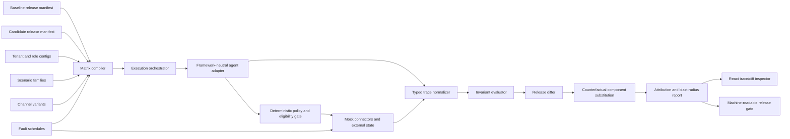

# Maven AGI: Technical Intelligence, Connection Mapping, and Build-Before-Outreach Strategy

**Research snapshot:** 22 August 2026  
**Candidate:** Giacomo Cappelletto  
**Scope:** research, project specification, connection mapping, and recommended outreach sequence only. No message, application, introduction request, issue, or other communication has been sent.  
**Supporting files:** [source registry](./sources.md) · [critical validation](./validation.md) · [machine-readable project specification](./project-spec.yaml)

## 1. Executive Decision

**Prioritize Maven AGI, but as a build-first relationship target rather than an immediate internship application.** Maven's public 2026 product and hiring signals converge on a technically demanding operating problem: shipping customer-specific, action-taking agents across enterprise systems and channels while preserving permissions, behavior, resolution quality, and production readiness. The observed careers snapshot contained multiple Boston technical, product, solutions, and forward-deployed roles, but no verified student or internship posting.

The strongest entry point is **differential release impact for multi-tenant enterprise agents**: when a policy, knowledge snapshot, model, action schema, permission, integration, or channel adapter changes, determine which customer configurations regress, how severe the blast radius is, and which changed component caused it.

The best first reviewer is **Justin Wright or the Solutions Engineering team**, followed by **Ryan Gemos or Forward Deployed Engineering**. They are closer than recruiting or a founder to customer-specific implementation, integration, evaluation, and launch validation. **Eugene Mann** is the best founder follow-on because the selected artifact sits in the customer-to-product feedback loop and Giacomo has a legitimate Boston University shared-institution path. **Sami Shalabi** is a later architecture/governance contact.

Build **TenantDiff: Customer-Specific Agent Release Impact Lab**. It compares baseline and candidate releases across synthetic tenants, channels, integrations, faults, and deterministic invariants, then performs counterfactual component substitution to attribute regressions.

This is superior to the other five candidates because it joins Maven's confirmed priorities—customer implementations, integrations/actions, deterministic control, evaluations, cross-channel behavior, and durable resolution—while avoiding a major redundancy discovered during research: several 2026 open-source projects already implement generic fault injection, replay, state oracles, and agent regression gates.

## 2. Evidence Ledger

Source identifiers resolve to the dated [source registry](./sources.md).

| Claim | Evidence | Source | Publication date | Event date | Confidence | Fact or inference |
|---|---|---|---:|---:|---|---|
| Maven is actively investing in Boston technical and customer-implementation capacity | The current careers surface showed multiple technical, product, solutions, and forward-deployed openings; no internship role was visible in the observed snapshot | [M1](./sources.md#m1--careers-and-current-hiring-surface) | Evergreen / accessed 2026-08-22 | 2026-08-22 | High | Fact about the snapshot |
| Forward Deployed Engineering is a core product-development mechanism | Maven describes FDE as a first-class product-engineering team between Product and GTM that configures workflows, integrates systems, pressure-tests edges, validates production readiness, and feeds learning back into the product | [M2](./sources.md#m2--forward-deployed-engineers) | 2026-01-16 | 2026-01-16 | High | Fact |
| Customer-specific configuration is central to current delivery | FDE material emphasizes exact customer workflows, policies, integrations, launch validation, and reusable product feedback | [M2](./sources.md#m2--forward-deployed-engineers) | 2026-01-16 | 2026-01-16 | High | Fact |
| Maven is formalizing an integration platform rather than only adding one-off connectors | The Integrations PM remit includes platform/framework ownership, integration velocity, depth-versus-breadth decisions, customer extension, and partner strategy | [M5](./sources.md#m5--product-manager-integrations) | Live posting | 2026-08-22 | Very high | Fact |
| Safe action definition and testing are explicit current concerns | The Integrations role owns how agent actions are defined, tested, and made safe at enterprise scale | [M5](./sources.md#m5--product-manager-integrations) | Live posting | 2026-08-22 | Very high | Fact |
| OAuth, APIs, rate limits, webhooks, and event streams are in Maven's stated integration problem space | The current Integrations job description names these mechanisms and their failure modes | [M5](./sources.md#m5--product-manager-integrations) | Live posting | 2026-08-22 | Very high | Fact; not evidence of a defect |
| Regression testing before deployment is an advertised product capability | Agent Designer exposes simulation, evaluations, regression testing, and change validation | [M3](./sources.md#m3--agent-designer) | Evergreen / accessed 2026-08-22 | 2026-08-22 | Very high | Fact |
| Maven exposes decision/action trace inspection | Agent Designer describes inspection of rationale, context, and the basis for behavior | [M3](./sources.md#m3--agent-designer) | Evergreen / accessed 2026-08-22 | 2026-08-22 | High | Fact |
| Governance is framed as deterministic pre-reasoning control | Maven describes access, action, permission, and escalation boundaries as constraints established before model reasoning | [M7](./sources.md#m7--deterministic-control) | 2026-03-09 | 2026-03-09 | Very high | Fact |
| Customer/user segmentation gates eligible knowledge and actions | Segments determine what knowledge/actions are available before the model reasons | [M8](./sources.md#m8--segments) | 2026-07-06 | 2026-07-06 | Very high | Fact |
| Action-taking is a current product surface | Agent Capabilities supports real-time retrieval and action execution in connected systems | [M9](./sources.md#m9--agent-capabilities) | 2026-03-18 | 2026-03-18 | High | Fact |
| Knowledge version and context correctness are productized | Agent Platform emphasizes correct version/context and governed enterprise knowledge | [M4](./sources.md#m4--agent-platform) | Evergreen / accessed 2026-08-22 | 2026-08-22 | High | Fact |
| Cross-channel consistency is an explicit goal | Maven's Zendesk integration describes one configuration/reasoning foundation across chat, messaging, email, and voice | [M17](./sources.md#m17--zendesk-integration) | Evergreen / accessed 2026-08-22 | 2026-08-22 | High | Fact |
| Voice is a major current technical investment | The live Voice PM description calls it a fast-growing and technically demanding modality | [M6](./sources.md#m6--product-manager-voice) | Live posting | 2026-08-22 | Very high | Fact |
| Latency, barge-in, STT/TTS, state, and handoff are explicitly owned voice concerns | These responsibilities appear directly in the Voice PM scope | [M6](./sources.md#m6--product-manager-voice) | Live posting | 2026-08-22 | Very high | Fact |
| Maven publicly discusses live voice failure conditions | A 2026 article distinguishes demos from noisy calls with overlap, accents, silence, and response gaps | [M15](./sources.md#m15--the-voice-channel-article) | 2026-08-12 | 2026-08-12 | High | Fact |
| Maven distinguishes apparent containment from actual resolution | Current evaluation guidance uses completed actions, reopen/re-contact, and outcome evidence rather than deflection alone | [M11](./sources.md#m11--enterprise-agent-evaluation-framework), [M12](./sources.md#m12--deflection-versus-resolution) | 2026-07-01 / 2026-06-29 | 2026 | Very high | Fact |
| Production-tail evaluation is a current priority | Maven explicitly calls out edge cases, query-distribution tails, integration reliability, and load that polished demos omit | [M11](./sources.md#m11--enterprise-agent-evaluation-framework) | 2026-07-01 | 2026-07-01 | Very high | Fact |
| Auditable actions and policy checks are explicit enterprise requirements | Security/governance material describes logging inputs, outputs, system references, and policy checks | [M13](./sources.md#m13--security-and-governance) | 2026-02-17 | 2026-02-17 | Very high | Fact |
| Structured fields with confidence/rationale are a recent product priority | Intelligent Fields turns conversations into typed downstream values with confidence and rationale | [M10](./sources.md#m10--intelligent-fields) | 2026-04-30 | 2026-04-30 | High | Fact |
| Maven has a broad public API/SDK surface | Its public organization exposes TypeScript, Python, Java, .NET, Swift, and Go SDKs | [M18](./sources.md#m18--maven-agi-public-github-organization) | Continuously updated | 2026-08-22 | High | Fact |
| The TypeScript SDK contains transport resilience primitives | It exposes typed errors, streaming, aborts, retries, and timeouts; the observed repo had a 2026-08-19 push | [M19](./sources.md#m19--maven-agi-typescript-sdk) | 2026-08-19 snapshot | 2026-08-19 | High | Fact |
| Giacomo has direct enterprise-agent architecture experience | MOVE spans a Databricks serving runtime, governed SQL/retrieval, typed contracts, evidence review, tracing, evaluation, and a React/FastAPI interface | [G1](./sources.md#g1--master-resume-source), [G2](./sources.md#g2--move-portfolio-source), [G3](./sources.md#g3--move-source-pinned-truth-ledger) | 2026 sources | Jun–Aug 2026 | Very high | Fact about candidate evidence |
| Giacomo documents implementation claims against exact repository snapshots and symbols | The MOVE truth ledger binds visual/system claims to source commits, paths, symbols, confidence, and scope | [G3](./sources.md#g3--move-source-pinned-truth-ledger) | 2026 | July 2026 snapshots | Very high | Fact |
| Giacomo already builds regression gates rather than demonstration-only UIs | His site includes cross-browser Playwright tests, exhaustive mobile route checks, error/overflow assertions, reduced-motion/Save-Data paths, and performance budgets | [G4](./sources.md#g4--portfolio-productiontest-documentation) | 2026 | 2026 | High | Fact |
| Giacomo structures long ML pipelines around contracts, provenance, diagnostics, and tests | The rowing repository includes a packaged pipeline, feature contracts, model bundles, reports, leakage warnings, overrides, and 50 tests across eight modules | [G6](./sources.md#g6--rowing-dynamics-system) | 2026 | 2026 | High | Fact |
| Giacomo implements explicit mathematical/software invariants | The contextual-similarity reference validates balanced batches, shape/range constraints, finite gradients, and deterministic smoke behavior | [G7](./sources.md#g7--contextual-similarity-study-pack) | 2026 | July 2026 | High | Fact |
| Giacomo has relevant integration and operational-state experience | His Tauri/Rust inventory system uses Shopify GraphQL/REST, two-location state, Firestore audit history, bounded recovery, and signed releases | [G2](./sources.md#g2--move-portfolio-source), [G8](./sources.md#g8--inventory-system) | 2025–2026 | 2025–2026 | High | Fact |
| No warm Maven path was found in connected accounts | Gmail, Contacts, and GitHub searches found no Maven correspondence/contact/mutual contribution; Brian Kulis is direct, but no Kulis-to-Maven relationship was verified | [G10](./sources.md#g10--connected-account-network-audit) | Search executed 2026-08-22 | 2026-08-22 | High | Fact about searched sources; not proof no path exists anywhere |
| A generic state/fault/replay benchmark would be redundant | ConsequenceBench, Open-Weight Agent Reliability Lab, AgentProbe, and AgentReplay already cover substantial portions of state correctness, deterministic faults, replay, and CI regression | [O1](./sources.md#o1--consequencebench), [O2](./sources.md#o2--open-weight-agent-reliability-lab), [O3](./sources.md#o3--agentprobe), [O4](./sources.md#o4--agentreplay) | Jun–Aug 2026 | Jun–Aug 2026 | Very high | Fact and design implication |
| The best remaining open contribution is configuration-matrix change impact and attribution | Maven's public architecture combines customer configurations, deterministic eligibility, integrations, actions, channels, simulations, and FDE deployment; existing reviewed OSS does not center multi-tenant blast-radius attribution | M2–M9, M17, O1–O8 | Through 2026-08-22 | 2026-08-22 | Medium-high | Strong inference, not a claim about Maven internals |

### Primary hypothesis verdict

The hypothesis is **supported with a narrower formulation**:

> Maven's current engineering frontier is not merely producing useful answers. Public evidence shows active investment in safely configuring, evaluating, integrating, and deploying action-taking agents across customer-specific knowledge, permissions, systems, and channels. The most defensible open problem for an external artifact is therefore differential release impact and attribution—not a claim that Maven lacks regression testing or state-verification infrastructure.

The evidence does **not** support saying that Maven has an internal regression, idempotency, schema-drift, replay, or observability deficiency. Those are engineering risk classes implied by the public product surface and hiring scope, not disclosed incidents.

## 3. Technical Pressure-Point Analysis

### 3.1 Cross-channel behavioral consistency

**Classification: Confirmed current priority**

**Publicly confirmed.** Maven advertises a shared configuration/reasoning foundation across chat, messaging, email, and voice, and its Voice product is a major current investment ([M6](./sources.md#m6--product-manager-voice), [M17](./sources.md#m17--zendesk-integration)).

**Inference boundary.** A shared foundation creates a release blast radius across modalities, but no public source establishes that Maven is currently suffering cross-channel regressions.

**Why it matters technically.** Channel adapters alter turn boundaries, latency, verbosity, metadata, interruption behavior, attachment availability, and escalation timing. A policy that is correct in asynchronous email can be unsafe or unusable in a partial voice turn. A useful release test should assert common business invariants while allowing channel-appropriate wording and timing.

**Relation to current product/hiring.** Voice ownership explicitly includes state, barge-in, latency, and handoff; Zendesk integration material emphasizes one agent configuration across multiple channels.

**Giacomo fit.** Direct. MOVE uses request-scoped context and typed response contracts; his portfolio tests multiple browser engines, mobile modes, reduced-motion behavior, and production budgets. He has demonstrated a habit of preserving invariants across execution surfaces rather than validating one happy path.

### 3.2 Regression testing after policy, prompt, knowledge, model, or tool changes

**Classification: Confirmed current priority**

**Publicly confirmed.** Agent Designer explicitly includes simulations, evaluations, and regression tests before deployment ([M3](./sources.md#m3--agent-designer)).

**Inference boundary.** This confirms salience, not inadequacy. Building another prompt-comparison or generic evaluation dashboard would duplicate Maven's advertised product and mature open-source systems.

**Why it matters technically.** Enterprise releases combine multiple versioned components. A changed answer may be intended; an unchanged answer may hide a changed action, evidence source, permission path, latency budget, or external effect. The unit of comparison must include component manifests, invariants, traces, and resulting state.

**Relation to current product/hiring.** Agent Designer covers pre-release validation; FDE covers customer-specific production readiness; Integrations owns action definition/testing.

**Giacomo fit.** Very strong. He has prompt versioning, MLflow evaluation/judging, source-pinned claims, typed contracts, test gates, and deterministic artifact parity in public repositories.

### 3.3 Voice latency, interruption handling, noisy transcription, turn-taking, and human handoff

**Classification: Confirmed current priority**

**Publicly confirmed.** The current Voice PM scope explicitly includes latency budgets, barge-in, STT/TTS, state, and handoff. Maven's August voice article discusses overlap, accents, silence, and response gaps ([M6](./sources.md#m6--product-manager-voice), [M15](./sources.md#m15--the-voice-channel-article)).

**Inference boundary.** Public evidence does not disclose internal latency distributions, failure rates, or architecture.

**Why it matters technically.** Voice introduces partial observations and real-time deadlines. The system may begin a tool action before the user's intent is stable; a late interruption may require cancellation or handoff; transcript errors can change authorization-sensitive arguments.

**Relation to current product/hiring.** This is one of the clearest current hiring signals.

**Giacomo fit.** Moderate-to-strong but not uniquely differentiated. Temporal signals, video pipelines, streaming interfaces, and evaluation help, but he has less direct telephony/STT/TTS experience than enterprise-agent integration experience. Voice should be represented as transcript perturbations in V1, not the project's core claim.

### 3.4 Integration reliability: authentication expiry, schema drift, permissions, rate limits, retries, and idempotency

**Classification: Confirmed current priority overall; specific schema-drift/idempotency incidence is a strong inference**

**Publicly confirmed.** Maven's current Integrations remit names APIs, OAuth, rate limits, event streams, integration failure modes, and safe action testing ([M5](./sources.md#m5--product-manager-integrations)). Its public SDK documents retries, timeouts, typed errors, and streaming ([M19](./sources.md#m19--maven-agi-typescript-sdk)).

**Inference boundary.** Schema drift and idempotency are standard consequences of a write-capable integration platform, but the sources do not say they are active Maven defects.

**Why it matters technically.** A post-commit timeout is semantically different from a pre-commit failure. Repeating a write without stable idempotency can duplicate a refund or ticket update. OAuth refresh can change scopes. A schema change can produce syntactically valid but semantically wrong arguments.

**Relation to current product/hiring.** Integration depth, action safety, and customer extension are explicit current ownership areas.

**Giacomo fit.** Excellent. He has governed tool execution, typed contracts, Shopify GraphQL/REST, multi-location reconciliation, audit logs, dynamic SQL validation, retries, and production deployment.

### 3.5 Partial action failure across multi-step workflows

**Classification: Strong inference**

**Publicly confirmed.** Maven supports actions and multi-system enterprise workflows ([M4](./sources.md#m4--agent-platform), [M9](./sources.md#m9--agent-capabilities)).

**Inferred.** Any workflow spanning multiple writes can partially complete. No source states that partial commits are a known Maven incident class.

**Why it matters technically.** Ticket closure may succeed while a refund fails; an identity update may commit in one system but not another. Correct behavior can require compensation, readback, or escalation rather than a blind retry.

**Relation to current product/hiring.** FDE launch validation and Integrations action testing make this a credible external test dimension.

**Giacomo fit.** Strong. His systems work uses explicit workflow boundaries, audit state, evidence review, and consistency checks. The selected project should include one two-step workflow but not attempt a general distributed transaction framework.

### 3.6 Apparent resolution versus correct and durable resolution

**Classification: Confirmed current priority**

**Publicly confirmed.** Maven repeatedly distinguishes deflection from resolution and recommends backend-action completion plus reopen/re-contact measurement ([M11](./sources.md#m11--enterprise-agent-evaluation-framework), [M12](./sources.md#m12--deflection-versus-resolution)).

**Inference boundary.** This does not prove Maven agents currently produce false resolutions.

**Why it matters technically.** Language-only grading can pass a response that says a problem is fixed while the external system remains unchanged, changed twice, or reverts after eventual consistency. A release gate must check state and durability windows where appropriate.

**Relation to current product/hiring.** Outcome-oriented evaluation and action-taking integrations make this a first-class metric.

**Giacomo fit.** Very strong. His work already separates successful normalized evidence from unsupported answers, logs tool activity, and validates operational outputs against telemetry or source state.

### 3.7 Knowledge conflicts, stale content, duplicates, and update propagation

**Classification: Confirmed current priority for version/context eligibility; strong inference for duplicate/conflict frequency**

**Publicly confirmed.** Agent Platform and Segments emphasize correct version/context and deterministic eligibility of knowledge/actions ([M4](./sources.md#m4--agent-platform), [M8](./sources.md#m8--segments)).

**Inference boundary.** The public material does not disclose the rate of stale or duplicate content failures.

**Why it matters technically.** A release may preserve answer fluency while switching to an ineligible document version. Tenant-specific knowledge updates can propagate at different times and conflict with shared policy.

**Relation to current product/hiring.** Knowledge management, segmentation, Agent Designer evaluation, and customer-specific FDE configuration all touch this risk.

**Giacomo fit.** Direct. MOVE includes citation-backed retrieval, document parsing/chunking, prompt/version governance, and evidence review. TenantDiff should hash knowledge snapshots and test eligibility, but not become a generic RAG benchmark.

### 3.8 Traceability from decision to instructions, evidence, tool calls, and resulting external state

**Classification: Confirmed current priority**

**Publicly confirmed.** Agent Designer and security/governance material describe decision inspection, audit trails, system references, and policy checks ([M3](./sources.md#m3--agent-designer), [M13](./sources.md#m13--security-and-governance)).

**Inference boundary.** A generic trace viewer is redundant. Public sources do not specify Maven's private trace schema.

**Why it matters technically.** A release-impact system must distinguish correlation from cause. It should identify whether a regression followed a policy hash, knowledge snapshot, tool schema, permission, retry rule, model, or channel transform.

**Relation to current product/hiring.** Traceability connects governance, evaluations, integrations, and FDE debugging.

**Giacomo fit.** Exceptional. The MOVE truth ledger pins claims to exact repository snapshots and symbols; the agent work uses end-to-end tracing and typed output contracts. This is a strong basis for causal release manifests.

### 3.9 Release gates for customer-specific configurations

**Classification: Strong inference**

**Publicly confirmed.** Maven advertises pre-release simulation/regression; FDE validates customer-specific production readiness; Segments and deterministic control create customer-specific eligibility surfaces ([M2](./sources.md#m2--forward-deployed-engineers), [M3](./sources.md#m3--agent-designer), [M7](./sources.md#m7--deterministic-control), [M8](./sources.md#m8--segments)).

**Inferred.** A matrix-wide, machine-readable gate that quantifies blast radius across tenant configurations is not publicly described. It may exist internally.

**Why it matters technically.** A global change can pass aggregate evaluation while breaking one regulated tenant, one permission tier, or voice only. Release decisions need severity-weighted per-configuration evidence.

**Relation to current product/hiring.** This is the intersection of Agent Designer, FDE, Integrations, and multi-channel deployment.

**Giacomo fit.** Very strong. He has experience with versioned prompts, deployment targets, request-scoped controls, CI gates, and explicit test matrices.

### 3.10 Efficient reproduction of rare production failures

**Classification: Strong inference**

**Publicly confirmed.** Maven emphasizes production tails, edge cases, integration reliability, and feedback from real deployments ([M2](./sources.md#m2--forward-deployed-engineers), [M11](./sources.md#m11--enterprise-agent-evaluation-framework)).

**Inferred.** No source says Maven lacks replay or failure-minimization tooling.

**Why it matters technically.** Rare failures often require a precise tenant configuration, channel transform, fault timing, and release component set. Reproduction is more useful when the system can minimize the responsible delta rather than replaying an opaque full trace.

**Relation to current product/hiring.** FDE production debugging and launch validation make reproducibility salient.

**Giacomo fit.** Strong. His projects preserve provenance, configuration, run artifacts, and deterministic tests. TenantDiff should add replay and delta minimization as supporting mechanisms, not claim replay itself as novel.

## 4. Connection Map

### Ranked target table

No A- or B-strength relationship to a Maven employee was verified. The ranking below is intentionally conservative.

| Rank | Target person | Current/public role at snapshot | Why technically relevant | Connection path | Evidence for path | Relationship strength | Best introduction request |
|---:|---|---|---|---|---|---|---|
| 1 | **Justin Wright** | Publicly listed Solutions Engineering leader | Closest observable reviewer for customer-specific integrations, evaluations, launch validation, and reusable solution patterns | Giacomo → finished TenantDiff result → evidence-based direct technical approach | Public role/profile [P3](./sources.md#p3--justin-wright); no direct account relationship found [G10](./sources.md#g10--connected-account-network-audit) | **D** | Ask for criticism of the release-impact matrix and which customer-configuration failure class is missing; do not ask for a job |
| 2 | **Ryan Gemos** | Publicly listed Forward Deployed Engineer | Likely to evaluate whether the synthetic configuration/fault cases resemble real launch and production-debugging work | Giacomo → finished artifact → evidence-based direct technical approach | Public role/profile [P4](./sources.md#p4--ryan-gemos); FDE remit [M2](./sources.md#m2--forward-deployed-engineers) | **D** | Ask whether causal component substitution would be useful when a customer-specific release regresses |
| 3 | **Eugene Mann** | Maven cofounder and product leader | Owns the product/customer feedback loop; suitable founder follow-on after technical review | Giacomo → Boston University shared institution → Eugene | Public BU/Questrom affiliation [P1](./sources.md#p1--eugene-mann); no first-degree intermediary verified | **C** | Through a BU alumni/entrepreneurship intermediary, request a technical review of a completed result, not an internship referral |
| 4 | **Sam Granat** | Maven product manager / public 2026 product author | Relevant to Capabilities, Intelligent Fields, typed outputs, and action/evaluation product questions | Giacomo → finished artifact → direct technical/product approach | Product launches [M9](./sources.md#m9--agent-capabilities), [M10](./sources.md#m10--intelligent-fields); no direct relationship found | **D** | Ask whether confidence-bearing typed fields should participate in a release gate as outputs, evidence, or both |
| 5 | **Sami Shalabi** | Maven cofounder and technical leader | Relevant to deterministic control, permissions, action boundaries, and architecture | Giacomo → completed artifact → technical cold approach; MIT ecosystem is shared community only | Public technical/MIT affiliation [P2](./sources.md#p2--sami-shalabi); deterministic-control source [M7](./sources.md#m7--deterministic-control) | **D** | Ask one architecture question after an FDE/Solutions response; do not present a speculative Kulis→Sami chain |
| 6 | **Sam Schatz** | Publicly listed Maven talent/recruiting contact | Appropriate only after a technical employee validates relevance or recommends a recruiting conversation | Giacomo → technical interaction → recruiting | Public role/profile [P5](./sources.md#p5--sam-schatz) | **D** | Reference the technical interaction and ask about future student/co-op/intern pathways; do not lead with a generic application |
| — | **Brian Kulis** | BU professor and Giacomo's current research supervisor; intermediary, not Maven employee | Can credibly assess the project and may know relevant Boston/MIT researchers, but no Maven relationship was verified | Giacomo → Brian directly | Direct relationship verified in connected Gmail and candidate sources [G1](./sources.md#g1--master-resume-source), [G10](./sources.md#g10--connected-account-network-audit) | **A to Brian only** | Ask whether he personally knows anyone who would enjoy reviewing the artifact; use no named Maven chain unless he confirms it |

### Five strongest usable paths

#### Path 1 — Direct technical review from Justin Wright

- **Exact chain:** Giacomo → public TenantDiff repository/result → Justin Wright.
- **Why credible:** Giacomo is not sending an abstract pitch; he is presenting a quantified release-impact experiment at the intersection of solutions, integrations, and evaluation.
- **Request to send after completion:** “I compared two action-agent releases across four synthetic customer configurations and found that aggregate pass rate hid a tenant-specific permission regression. The attribution pass isolated the policy/tool-schema interaction. Which configuration dimension would you add before treating this as a useful launch-safety benchmark?”
- **Artifact required:** clean public repository, reproducible benchmark command, results table, architecture diagram, two-minute demo, and 2–3 page memo.

#### Path 2 — Direct FDE criticism from Ryan Gemos

- **Exact chain:** Giacomo → TenantDiff failure-reproduction case → Ryan Gemos.
- **Why credible:** FDE publicly owns customer-specific workflow configuration, edge pressure testing, and production readiness. The artifact should ask whether its abstraction matches that work.
- **Request:** ask for criticism of the causal attribution method, especially whether component substitution would help distinguish customer config from platform behavior.
- **Artifact required:** one minimized failure case showing baseline, candidate, responsible delta, state outcome, and replay command.

#### Path 3 — Boston University institutional path to Eugene Mann

- **Exact chain:** Giacomo → BU entrepreneurship/alumni or engineering contact who actually knows Eugene → Eugene.
- **Why credible:** both share BU; Giacomo can present a serious technical artifact aligned with Maven's customer/product loop.
- **Request to intermediary:** “Would you be comfortable forwarding this completed technical memo to Eugene as a BU student seeking criticism on multi-tenant agent release testing? I am not asking you to recommend me for a role.”
- **Artifact required:** finished work only. A shared institution is not sufficient for an introduction before the artifact exists.

#### Path 4 — Conditional Brian Kulis network check

- **Exact chain:** Giacomo → Brian Kulis → only a person Brian independently says he knows.
- **Why credible:** Brian is a real direct research relationship and can evaluate Giacomo's rigor.
- **Request:** “I finished a reproducible agent-release impact study. Do you personally know anyone in the Boston enterprise-agent or Maven ecosystem who would find the technical question useful?”
- **Artifact required:** benchmark results and memo. Until Brian confirms a contact, the path beyond him is **X and must not be represented as warm**.

#### Path 5 — Product-level cold approach to Sam Granat

- **Exact chain:** Giacomo → TenantDiff typed-field/config result → Sam Granat.
- **Why credible:** the project includes typed outputs with confidence/rationale and asks how those fields should behave under release changes.
- **Request:** ask one product-technical question about whether a typed field's semantic stability should be an invariant independent of conversational wording.
- **Artifact required:** a concise example where the answer remains acceptable but a typed field or permitted action changes incorrectly.

### Network findings that must remain explicit

- No Maven email or saved contact was found in connected Gmail/Contacts.
- No verified GitHub follower, contributor, issue, pull-request, or organization mutual path was found.
- No Databricks employee correspondence was found that creates a Maven introduction path.
- No Banca Mediolanum colleague-to-Maven path was verified.
- A shared former employer at different times is not treated as a warm connection.
- Brian Kulis is A-strength directly, but the chain from Brian to Maven is unverified.

## 5. Project Ranking

Scores are 1–10. “Total” is out of 80.

| Rank | Candidate | Company specificity | Evidence strength | Technical depth | Candidate fit | Demonstrability | Conversation value | Scope realism | Originality | Total |
|---:|---|---:|---:|---:|---:|---:|---:|---:|---:|---:|
| **1** | **TenantDiff: Customer-Specific Agent Release Impact Lab** | 10 | 10 | 10 | 10 | 9 | 10 | 8 | 10 | **77** |
| 2 | Durable Resolution Contract Suite | 9 | 10 | 9 | 10 | 10 | 9 | 9 | 7 | **73** |
| 3 | Integration Contract Drift and Auth-Expiry Harness | 10 | 10 | 10 | 9 | 8 | 10 | 8 | 8 | **73** |
| 4 | Voice/Chat State and Handoff Consistency Lab | 10 | 10 | 9 | 7 | 10 | 10 | 7 | 9 | **72** |
| 5 | Knowledge Eligibility and Version-Propagation Auditor | 9 | 9 | 9 | 10 | 8 | 9 | 9 | 7 | **70** |
| 6 | Rare Agent Failure Minimizer | 8 | 8 | 10 | 9 | 8 | 10 | 7 | 9 | **69** |

### 1 — TenantDiff: Customer-Specific Agent Release Impact Lab

Compares release A/B across synthetic tenants, channels, policies, knowledge, permissions, tool schemas, integration behavior, and faults. It produces a blast-radius report and uses controlled component substitution to identify the smallest release delta sufficient to reproduce each regression.

**Why selected:** it is the only candidate that directly unifies Maven's publicly confirmed multi-customer FDE model, deterministic eligibility, action integrations, cross-channel configuration, Agent Designer regression testing, and durable-resolution measurement. It also remains distinct from generic fault/replay/state benchmarks.

### 2 — Durable Resolution Contract Suite

Tests whether an agent's “resolved” claim corresponds to correct external state, remains correct after a delay, and avoids repeat contact/reopen.

**Strength:** extremely clear two-minute demonstration and direct Maven relevance.  
**Weakness:** state-aware consequence benchmarks now overlap substantially, reducing originality.

### 3 — Integration Contract Drift and Auth-Expiry Harness

Tests agents/connectors under expired OAuth, scope changes, rate limits, schema changes, pre/post-commit failures, idempotent retries, and delayed visibility.

**Strength:** deep systems work and direct Integrations relevance.  
**Weakness:** deterministic integration fault labs already exist; it needs tenant/config attribution to stand out.

### 4 — Voice/Chat State and Handoff Consistency Lab

Perturbs the same intent into chat, email, and noisy/partial voice transcripts, then measures invariant preservation, interruption behavior, cancellation, and escalation/handoff.

**Strength:** highly current and visually demonstrable.  
**Weakness:** real voice timing requires more than transcripts, and Giacomo's direct telephony experience is limited.

### 5 — Knowledge Eligibility and Version-Propagation Auditor

Tests tenant/user knowledge eligibility under document replacement, stale caches, conflicting versions, and segment changes.

**Strength:** strong match to MOVE and deterministic Segments.  
**Weakness:** risks looking like another RAG-evaluation project unless tightly centered on release impact.

### 6 — Rare Agent Failure Minimizer

Takes a failing trace/configuration and minimizes channel events, knowledge documents, tool outputs, and config deltas to the smallest reproducible failure.

**Strength:** excellent engineer-to-engineer conversation value and meaningful debugging depth.  
**Weakness:** harder to build a sufficiently broad benchmark in ten days; replay/minimization tools already provide partial overlap.

## 6. Selected Project Specification

### 6.1 Project name

**TenantDiff: Customer-Specific Agent Release Impact Lab**

**One-line definition:** a vendor-neutral, reproducible system for measuring and attributing the blast radius of enterprise-agent changes across customer configurations, channels, integrations, and deterministic invariants.

### 6.2 Problem statement

Enterprise-agent behavior is not defined by a model and prompt alone. A deployed release is a composition of:

- base instructions and model;
- customer-specific policies;
- eligible knowledge versions;
- segment/user permissions;
- typed action schemas;
- connector implementations and credentials;
- retry/idempotency behavior;
- channel adapters;
- escalation and handoff rules.

Aggregate evaluation can pass while one customer configuration fails. A response-only evaluator can miss a changed external effect. A state oracle can detect the wrong result but still fail to identify which release component caused it.

TenantDiff answers four questions:

1. **Where did release B regress relative to release A?**
2. **Which tenants, roles, channels, and workflows are affected?**
3. **Which invariant failed—permission, evidence, action, state, resolution, escalation, or latency?**
4. **What is the smallest changed component set sufficient to reproduce the regression?**

### 6.3 Engineering user workflow

1. Define baseline and candidate release manifests.
2. Define four synthetic tenant configurations and role/segment policies.
3. Register scenario families, channel variants, expected invariants, and fault schedules.
4. Execute baseline/candidate across the tenant × role × channel × scenario × fault matrix.
5. Normalize traces and external-state transitions into framework-neutral contracts.
6. Compare outcomes and calculate severity-weighted blast radius.
7. For each blocking regression, run controlled counterfactual substitutions:
   - candidate model with baseline policy;
   - candidate policy with baseline tool schema;
   - candidate knowledge with baseline channel adapter;
   - and bounded combinations.
8. Return a ranked attribution result and a one-command deterministic replay.
9. Emit a human-readable report and machine-readable CI gate.

### 6.4 Explicit non-goals

- Do not use Maven customer data, private APIs, private prompts, or reverse-engineered interfaces.
- Do not imitate Agent Designer's UI.
- Do not build a generic RAG chatbot, support chatbot, prompt dashboard, observability dashboard, or thin LLM wrapper.
- Do not claim to measure Maven's system.
- Do not claim Maven lacks equivalent internal tooling.
- Do not implement real Salesforce, Zendesk, Shopify, Stripe, ServiceNow, or telephony writes in V1.
- Do not make an LLM judge the authority for permissions or external-state correctness.
- Do not attempt general causal inference; attribution is bounded to the explicitly versioned release components and controlled simulator.
- Do not implement live audio in the first release; use voice-transcript perturbations.

### 6.5 V1 experimental scope

#### Synthetic tenants

| Tenant | Domain | Distinguishing configuration |
|---|---|---|
| `commerce_standard` | E-commerce | address change and refund actions; standard permissions |
| `commerce_restricted` | E-commerce | refunds require escalation above a threshold |
| `saas_enterprise` | B2B SaaS | ticket/entitlement actions; role-sensitive knowledge |
| `saas_regulated` | B2B SaaS | strict segment gating, mandatory readback, shorter escalation threshold |

#### Roles

- end customer;
- support agent/coplay user;
- administrator;
- restricted contractor.

#### Channels

- chat;
- email;
- voice transcript with partial turns, disfluency, ASR substitutions, interruption markers, and silence events.

#### Mock connectors

1. **Commerce connector:** customers, orders, address updates, refund eligibility, refunds, readback.
2. **Ticketing/CRM connector:** tickets, entitlements, notes, escalation, closure, readback.

#### Canonical workflows

1. Order lookup and address update.
2. Refund eligibility, refund, and ticket closure.
3. Entitlement check and ticket action.
4. Failure or ambiguity followed by human escalation.

#### Release-delta classes

- policy/instruction change;
- knowledge snapshot change;
- permission/segment change;
- action schema change;
- connector retry/idempotency change;
- model change;
- channel-transform change.

### 6.6 System architecture



### 6.7 Core data model

#### `ReleaseManifest`

```python
class ReleaseManifest(BaseModel):
    release_id: str
    model_id: str
    model_config_hash: str
    instruction_hash: str
    policy_bundle_hash: str
    knowledge_snapshot_hash: str
    action_schema_hash: str
    connector_build_hash: str
    retry_policy_hash: str
    channel_adapter_hashes: dict[str, str]
```

#### `TenantConfiguration`

```python
class TenantConfiguration(BaseModel):
    tenant_id: str
    segment_rules: list[SegmentRule]
    permission_policy: PermissionPolicy
    escalation_policy: EscalationPolicy
    knowledge_binding: str
    enabled_actions: set[str]
    connector_config: ConnectorConfig
    latency_budgets_ms: dict[str, int]
```

#### `ScenarioCase`

- scenario ID and family;
- tenant and role;
- channel;
- initial external state;
- conversation turns/events;
- fault schedule;
- expected business invariants;
- permitted evidence/actions;
- expected final-state predicates;
- expected escalation/handoff behavior.

#### `NormalizedTrace`

- release/component hashes;
- instruction/policy version;
- eligible and retrieved evidence;
- typed conversation fields and confidence;
- tool/action selection and arguments;
- permission decision;
- attempts, retries, idempotency key, and error phase;
- external-state before/after hashes;
- verification/readback;
- escalation/handoff;
- per-stage latency.

#### `RegressionFinding`

- invariant category;
- baseline and candidate outcomes;
- affected tenant/role/channel cases;
- severity;
- external-state delta;
- minimal replay command;
- candidate responsible components;
- attribution confidence and counterfactual evidence.

### 6.8 APIs and event flow

#### Release registration

`POST /v1/releases`

Registers and hashes a release manifest. A release is immutable once referenced by a completed run.

#### Matrix compilation

`POST /v1/matrices`

Input: release pair, tenant set, roles, channels, scenarios, faults, trial/seed policy.  
Output: immutable matrix manifest and expected cell count.

#### Execution

`POST /v1/runs`

Runs a matrix or a selected subset. Each cell has a deterministic world/fault seed and isolated state.

#### Comparison

`POST /v1/comparisons`

Produces per-case differences, aggregate metrics, blocking findings, and changed-component inventory.

#### Attribution

`POST /v1/attributions`

Runs bounded counterfactual substitutions across changed components. V1 uses exhaustive single-component substitutions and pairwise combinations when at most four components changed; otherwise it uses greedy delta debugging with a fixed budget.

#### Replay

`POST /v1/replays` or CLI:

```bash
tenantdiff replay --finding RF-0042 --seed 42
```

#### Gate

```json
{
  "verdict": "fail",
  "blocking_findings": 2,
  "affected_tenants": 1,
  "affected_channels": ["voice_transcript"],
  "max_severity": "critical",
  "responsible_delta": ["permission_policy", "action_schema"],
  "attribution_confidence": 1.0
}
```

### 6.9 Failure-injection model

V1 must support deterministic scheduling by call number, action, phase, tenant, and channel.

| Failure | Phase semantics | Expected evaluation concern |
|---|---|---|
| Expired OAuth token | Before effect | refresh/re-auth or safe escalation; scope must not expand silently |
| Missing permission | Before effect | prohibited action must not be attempted/committed |
| HTTP 429 with `Retry-After` | Before effect | bounded delay and stable request identity |
| Transient 5xx | Before effect | retry according to policy without claiming success |
| Lost response after commit | After effect | readback/idempotent replay; no duplicate effect |
| Action schema drift | Validation or semantic mapping | invalid/incorrect arguments and changed field meaning |
| Stale/conflicting knowledge | Retrieval | evidence eligibility/version invariant |
| Duplicated event/webhook | Event intake | exactly-once logical handling where required |
| Delayed read-after-write visibility | After effect | avoid premature false-resolution claim |
| Partial multi-step success | Between effects | compensate, continue safely, or escalate according to policy |
| Interrupted voice turn | Before action | do not commit before intent/authorization is stable |

### 6.10 Evaluation methodology

#### Deterministic hard evaluation

The following are scored without an LLM judge:

- permission/segment eligibility;
- action schema validity;
- action authorization;
- exact committed effects and duplicates;
- final-state predicates;
- required post-action readback;
- evidence version/eligibility;
- escalation/handoff conditions;
- latency-budget violations;
- reproducibility under a fixed seed.

#### Semantic evaluation

An optional judge may score communication quality, but its result is reported separately and can never override a hard safety/state failure.

#### Differential evaluation

For each matrix cell:

```text
baseline outcome + candidate outcome + component diff
    → intended change / improvement / benign drift / blocking regression
```

Intended changes are declared in a release change manifest. An undeclared invariant change is a regression even if the final text is fluent.

#### Attribution evaluation

Because the benchmark controls the release components, it can create known injected regressions. Attribution is evaluated against the known responsible component set.

### 6.11 Baselines

1. **Output-only baseline:** semantic/regex checks on the final answer.
2. **Trajectory baseline:** tool-name and argument comparison without external-state or tenant-matrix reasoning.
3. **State-aware single-config baseline:** exact state/invariant checks for one default tenant, without blast-radius measurement or attribution.
4. **Replay-only baseline:** deterministic replay of a failing trace without component attribution.
5. **TenantDiff:** matrix comparison, invariant/state evaluation, blast radius, and bounded causal attribution.

The central experimental question is whether TenantDiff detects and attributes regressions hidden by aggregate or single-configuration evaluation.

### 6.12 Metrics

#### Primary

- **Blocking regression detection recall** against injected regressions.
- **Blocking regression precision** against declared intended changes and benign variation.
- **Attribution exact match** for the responsible component set.
- **Attribution top-1/top-2 component accuracy.**
- **Tenant blast radius:** affected weighted tenant configurations / tested weighted configurations.
- **Cross-channel invariant divergence rate.**
- **Permission-policy violation rate.**
- **External-state correctness.**
- **False-resolution rate.**
- **Duplicate-effect rate.**

#### Secondary

- evidence-eligibility violation rate;
- typed-field stability and calibration;
- escalation precision/recall;
- fault-recovery success;
- p50/p95 stage and total latency;
- replay determinism;
- attribution run cost and number of counterfactual cells.

#### Required quantitative finding

The project must report actual measured values, not a predetermined success narrative. A useful result would compare how many injected regressions each baseline detects and how accurately TenantDiff identifies their responsible component. If TenantDiff does not materially improve detection or attribution, the memo must report the negative result.

### 6.13 Test plan

#### Unit tests

- Pydantic model validation and canonical hashing;
- manifest immutability;
- policy/segment eligibility;
- fault schedule semantics;
- state transitions and readback;
- diff classification;
- attribution search.

#### Contract tests

Every connector must implement:

- typed read/write contracts;
- explicit pre-effect versus post-effect errors;
- idempotency behavior;
- permission checks;
- visibility/readback guarantees;
- deterministic reset and state export.

#### Property-based tests

Using Hypothesis:

- forbidden actions never produce committed effects;
- identical idempotency keys never produce more than one logical effect;
- `claimed_resolved=True` implies the configured verified-state predicate;
- fixed manifest, world, and seed produce the same fault schedule and hard scores;
- a tenant-scoped policy change cannot affect an unrelated tenant in the simulator;
- substituting all baseline components into candidate reproduces baseline hard outcomes.

#### Mutation tests

Inject known defects into:

- permission policy;
- action schema mapping;
- retry identity;
- knowledge binding;
- channel transform;
- resolution/readback logic.

These provide ground truth for detection and attribution metrics.

#### Integration tests

- full workflow per tenant;
- baseline/candidate matrix;
- single and pairwise component substitutions;
- CI gate output;
- clean-clone Docker Compose run.

#### UI tests

Minimal Playwright coverage:

- open a blocking finding;
- inspect baseline/candidate traces and state diff;
- identify affected tenant/channel;
- view attribution experiments;
- copy and execute replay command.

### 6.14 Security and privacy assumptions

- all users, tenants, documents, credentials, and business records are synthetic;
- no live SaaS write credentials;
- mock connectors bind to localhost/private Docker network only;
- no production or Banca Mediolanum data/code;
- logs redact synthetic secrets by contract;
- every test cell receives isolated external state;
- model access, if used, is read-only and separately configured;
- CI can run a deterministic scripted-agent baseline without external model keys;
- `SECURITY.md` states that this is an engineering benchmark, not a production-safety certification.

### 6.15 Repository structure

```text
tenantdiff/
├── README.md
├── LICENSE
├── SECURITY.md
├── pyproject.toml
├── docker-compose.yml
├── Makefile
├── docs/
│   ├── architecture.md
│   ├── benchmark-protocol.md
│   ├── release-manifest.md
│   ├── results.md
│   └── technical-memo.md
├── packages/
│   ├── contracts/
│   ├── matrix/
│   ├── policies/
│   ├── scenarios/
│   ├── channels/
│   ├── faults/
│   ├── connectors/
│   │   ├── commerce/
│   │   └── ticketing/
│   ├── tracing/
│   ├── evaluation/
│   ├── differ/
│   └── attribution/
├── adapters/
│   ├── scripted_reference.py
│   └── langgraph_reference.py
├── apps/
│   ├── api/
│   └── inspector/
├── fixtures/
│   ├── tenants/
│   ├── releases/
│   └── scenarios/
├── tests/
│   ├── unit/
│   ├── contract/
│   ├── property/
│   ├── mutation/
│   ├── integration/
│   └── ui/
├── benchmarks/
│   ├── manifests/
│   ├── raw/
│   └── results/
└── .github/workflows/
    ├── test.yml
    └── release-gate.yml
```

### 6.16 Open-source overlap and nonredundancy

TenantDiff must acknowledge and build around the following overlap:

- **ConsequenceBench:** exact external consequences, authority, evidence, retries, readback.
- **Open-Weight Agent Reliability Lab:** deterministic faults, typed tools, policy-gated writes, idempotent post-commit recovery.
- **AgentProbe:** cassettes, deterministic CI replay, regression gates.
- **AgentReplay:** replay and counterfactual mutation.
- **Langfuse, Braintrust, LangSmith:** traces, experiments, datasets, trajectory evaluation.
- **Promptfoo:** adversarial agent/tool testing.

TenantDiff is nonredundant only if its central contribution remains:

1. **multi-tenant/customer configuration matrices;**
2. **release component manifests and declared intended changes;**
3. **severity-weighted blast-radius measurement;**
4. **cross-channel invariant comparison;**
5. **counterfactual component substitution and attribution accuracy;**
6. **a quantitative comparison against output-, trajectory-, state-, and replay-only baselines.**

If V1 becomes only a state oracle, fault harness, replay tool, trace viewer, or CI evaluator, the project should be stopped or redesigned.

### 6.17 Two-minute demonstration script

**0:00–0:15 — Establish the matrix.**  
Show four tenants and three channels. Baseline release A passes all hard invariants.

**0:15–0:35 — Introduce candidate release B.**  
B contains three legitimate changes and one injected defect: a permission-policy refactor plus a renamed refund schema field.

**0:35–0:55 — Show the misleading aggregate.**  
Overall answer-quality and aggregate task pass remain nearly unchanged. The default tenant passes.

**0:55–1:20 — Reveal the hidden regression.**  
`commerce_restricted × contractor × voice_transcript` attempts a refund that should escalate. The final response is plausible, but the permission/action invariant fails.

**1:20–1:40 — Attribute.**  
Counterfactual substitutions show neither the policy change nor schema change alone reproduces the failure; their pair does. The blast radius is one tenant, one role, one channel, and one workflow family.

**1:40–1:55 — Replay and gate.**  
Run the one-command replay and show the machine-readable release gate fail with responsible components.

**1:55–2:00 — End on the result.**  
Show detection/attribution comparison against the four baselines, not the UI.

### 6.18 Public technical memo outline

1. Motivation: why aggregate agent evaluation misses customer-specific regressions.
2. Related work and open-source overlap.
3. Release/component/tenant model.
4. Controlled failure and intended-change design.
5. Matrix execution and hard invariants.
6. Blast-radius metrics.
7. Counterfactual attribution method.
8. Baselines and experimental protocol.
9. Results, including negative results.
10. Failure analysis.
11. Threats to validity and limitations.
12. Implications for enterprise-agent release gates.

### 6.19 Known limitations

- Synthetic tenant configurations are much simpler than real enterprise deployments.
- Component substitution identifies causes only within the declared manifest boundary.
- Model stochasticity can create apparent interactions; repeated trials and hard invariants reduce but do not eliminate this.
- Voice transcripts do not measure real acoustic, telephony, TTS, or timing behavior.
- Mock connectors simplify SaaS consistency and permission models.
- Pairwise attribution can miss higher-order interactions; exhaustive search becomes expensive.
- The benchmark distribution is not claimed to represent Maven production traffic.
- The project does not evaluate Maven and cannot establish a Maven internal tooling gap.

### 6.20 Exact success criteria

Call V1 successful only if every condition below is met:

1. Four distinct synthetic tenants and at least four roles/segments.
2. Three channel representations.
3. Two stateful mock connectors and four multi-step workflow families.
4. At least 36 canonical scenario cases before tenant/channel expansion.
5. At least eight deterministic fault or release-defect classes.
6. Baseline and candidate release manifests with at least five independently swappable component classes.
7. Deterministic hard evaluation and replay under a fixed seed.
8. At least 20 injected regressions with known responsible component sets.
9. Detection precision/recall and attribution exact/top-k metrics reported with raw result artifacts.
10. Comparison against output-only, trajectory-only, state-aware single-config, and replay-only baselines.
11. At least one demonstrated regression hidden by aggregate/default-tenant evaluation.
12. At least one demonstrated interaction requiring two changed components to reproduce.
13. Property, contract, mutation, integration, and minimal UI tests all pass from a clean clone.
14. One-command local benchmark and CI gate.
15. Public repository, 2–3 page memo, architecture diagram, benchmark table, and two-minute demo.
16. Claims remain bounded: no claim of production safety, Maven performance, or Maven internal deficiency.

## 7. Ten-Day Execution Plan

| Day | Build focus | Required exit criteria |
|---:|---|---|
| **1** | Freeze question, related work, and contracts | Publish an ADR defining the novelty boundary; freeze `ReleaseManifest`, `TenantConfiguration`, `ScenarioCase`, invariants, intended-change declarations, and success criteria. Reject any scope that collapses into a generic fault benchmark. |
| **2** | Tenant/configuration and external-state core | Four tenant fixtures, roles/segments, deterministic world state, canonical hashing, reset/export, and policy/eligibility engine pass unit tests. |
| **3** | Stateful connectors and fault semantics | Commerce and ticketing connectors implement typed reads/writes, permissions, idempotency, readback, pre/post-effect failures, delayed visibility, and contract tests. |
| **4** | Agent adapter and scenario families | Scripted reference agent plus small LangGraph reference adapter execute four workflows across chat; at least 36 canonical cases exist before matrix expansion. |
| **5** | Matrix compiler, channels, and tracing | Tenant × role × channel × scenario × fault matrix compiles deterministically; email and voice-transcript transforms preserve declared business intent; normalized traces include component hashes and state transitions. |
| **6** | Differential evaluator and gate | Baseline/candidate comparison classifies intended change, benign drift, improvement, and blocking regression; machine-readable gate fails deliberately broken releases. |
| **7** | Attribution engine and mutation corpus | Single/pair substitutions and bounded delta debugging run; at least 20 injected regressions have known responsible components; property and mutation tests pass. |
| **8** | Benchmark and baseline experiments | Run all baselines and TenantDiff with repeated seeds where model stochasticity exists; freeze raw JSONL/JSON artifacts, manifests, hashes, and benchmark tables. Do not tune thresholds after seeing results. |
| **9** | Inspector, memo, diagram, and demo | Minimal React inspector diagnoses a failure in under 60 seconds; architecture diagram and 2–3 page memo reach review quality; two-minute demo is scripted from real benchmark artifacts. |
| **10** | Independent clean-room verification and publication | Fresh clone completes install, tests, benchmark, report generation, and replay from documented commands; GitHub Actions pass; public repo, reproducible suite, benchmark results, memo, diagram, demo, and concise outreach summary are complete. |

### Day-10 mandatory deliverables

- public GitHub repository;
- reproducible test suite and one-command benchmark;
- immutable benchmark manifests and raw/summary results;
- two-to-three-page technical memo;
- architecture diagram;
- two-minute demonstration;
- one concise outreach summary;
- explicit related-work/nonredundancy section;
- explicit limitations and negative-result policy.

### Concise project summary for outreach

> I built TenantDiff, a vendor-neutral release-impact lab for action-taking enterprise agents. It compares baseline and candidate releases across synthetic customer configurations, permissions, knowledge, action schemas, channels, and integration faults, then uses controlled component substitution to identify the smallest release delta that reproduces each regression. The benchmark reports tenant/channel blast radius, hard state and permission invariants, and attribution accuracy against output-, trajectory-, state-, and replay-only baselines.

## 8. Outreach Sequence

### 8.1 Preconditions

Do not begin outreach until all of the following exist:

- reproducible public repository;
- nontrivial measured result;
- clean README and 2–3 page memo;
- architecture diagram;
- two-minute demo;
- one minimized blocking regression with replay command;
- explicit overlap/limitations section;
- no Maven branding or claim that the project reproduces Maven internals.

### 8.2 First technical contact

**Justin Wright / Solutions Engineering.**

Lead with one result and one question. Do not lead with biography, GPA, résumé, or an internship request.

Suggested structure:

> I built a small release-impact benchmark for action-taking enterprise agents. Aggregate and default-tenant evaluation passed one candidate release, but a restricted-tenant/voice case violated a permission invariant; controlled component substitution showed the failure required an interaction between the policy and action-schema changes. I am trying to determine whether tenant/configuration blast radius plus bounded attribution is a useful abstraction for launch validation. Which configuration dimension or failure class would you add first?

Include only the repository, memo, and two-minute demo.

### 8.3 Second contact

**Ryan Gemos / Forward Deployed Engineering**, three to five business days later if Justin does not respond, or immediately if Justin recommends him.

Use a different question:

> Does the minimized replay capture enough context to be useful to an FDE, or would a real customer failure normally require a different boundary—such as data snapshot, credential state, or deployment history?

Do not send an identical message to multiple people.

### 8.4 Product contact

**Sam Granat**, after the first technical contact or after one completed follow-up.

Ask specifically whether typed conversation fields and confidence/rationale should be release invariants independent of the conversational answer.

### 8.5 Founder contact

**Eugene Mann** is the first founder contact. Use the BU shared-institution route if a real intermediary is available; otherwise use a concise evidence-based cold approach after technical outreach.

Reason for Eugene before Sami: the selected artifact sits directly in customer implementation, product feedback, evaluation, and integration strategy.

**Sami Shalabi** is a later architecture contact if the discussion reaches deterministic controls, permission gates, action eligibility, or platform design.

### 8.6 Recruiting contact

**Sam Schatz / Maven talent team** only after:

- a technical employee responds;
- an employee recommends recruiting;
- or a relevant student/intern role appears.

The observed 2026-08-22 careers snapshot did not verify an internship opening. Do not apply to a senior role merely to enter the system.

Recruiting request:

> Reference the artifact and technical interaction, then ask whether Maven anticipates a Summer 2027 internship, co-op, part-time term project, or future student-engineering pathway aligned with FDE, integrations, evaluation, or platform work.

### 8.7 Warm-introduction route

1. Finish TenantDiff.
2. Ask Brian Kulis whether he personally knows anyone in the Boston enterprise-agent/Maven ecosystem who would find the result technically useful.
3. Separately search BU alumni/entrepreneurship channels for an intermediary who actually knows Eugene.
4. Request forwarding of the memo for technical criticism, not a referral.

A BU affiliation alone is a C connection. It becomes B only when a verified first-degree intermediary confirms willingness to introduce.

### 8.8 Evidence-based cold route

Recommended order:

1. Justin Wright.
2. Ryan Gemos.
3. Sam Granat.
4. Eugene Mann.
5. Sami Shalabi, only for a distinct architecture question.
6. Recruiting after technical signal.

### 8.9 Timing and follow-up

| Timing | Action |
|---|---|
| Project day 10–11 | Publish and perform one final clean-clone verification; make no outreach on the same minute as publication |
| Day 12 | First technical message to Justin |
| Day 16–17 | One follow-up only if there is a new result, fix, or clarified question |
| Day 17–19 | Ryan or Sam Granat with a distinct technical question |
| Day 22+ | Eugene, preferably through a verified BU intermediary; otherwise concise cold route |
| After technical response | Recruiting/future-opportunity question |

Maximum two unanswered contacts to the same person. Stop sending follow-ups when no new technical information is available.

### 8.10 What not to do

- Do not begin with “I am looking for an internship.”
- Do not send the full résumé without relevance.
- Do not imply Maven has a problem or lacks tooling.
- Do not ask an intermediary to recommend work they have not reviewed.
- Do not contact every founder/engineer simultaneously.
- Do not post issues in Maven SDK repositories merely to get attention.
- Do not use private employer details or data.
- Do not send any communication without explicit approval.

## 9. Disconfirmation and Stop Conditions

### 9.1 Evidence that would invalidate the selected pressure point

Downgrade the recommendation if current evidence shows that:

- Maven shifts away from customer-specific action-taking integrations toward a materially different product direction;
- FDE/Solutions/Integrations cease to be active product and hiring surfaces;
- customer configurations, permissions, channels, and actions are no longer coupled in deployment;
- a public Maven source establishes that release impact is evaluated only at a global, non-tenant-specific layer and that tenant configuration is outside the platform's scope.

A future disclosure that Maven already has comprehensive multi-tenant attribution tooling would not make the engineering question false, but it would reduce the artifact's conversation value.

### 9.2 Evidence that would invalidate the project concept

Stop or redesign TenantDiff if:

1. an existing open-source project already provides the same combination of multi-tenant configuration matrices, declared intended changes, severity-weighted blast radius, cross-channel invariants, and measured component-attribution accuracy;
2. a ten-day prototype cannot produce a meaningful controlled attribution result and becomes only a dashboard;
3. state-aware single-config evaluation catches every injected regression, making the tenant matrix add no measured value;
4. component substitution cannot recover known injected causes above a trivial baseline;
5. the result depends primarily on an LLM judge rather than deterministic policy/state contracts;
6. the project requires real customer data or live write credentials;
7. scope pressure removes reproducibility, raw artifacts, or baseline comparison.

### 9.3 Evidence that would invalidate the assumed contact path

- Justin, Ryan, Sam, Eugene, Sami, or Sam Schatz change roles or leave Maven.
- The public profile evidence is stale.
- A BU intermediary does not actually know Eugene.
- Brian Kulis says he has no relevant contact.
- A new direct first-degree relationship appears and supersedes the current route.
- A technical employee indicates another team owns the problem; follow that referral rather than preserving this ranking.

Do not upgrade any C/D path to B without explicit evidence of a willing first-degree intermediary.

### 9.4 Evidence that Maven is not a realistic current target

Deprioritize Maven if several of the following occur:

- Boston technical hiring materially contracts without replacement;
- future student/intern/co-op work is categorically unavailable for Giacomo's timing or work authorization;
- the company stops investing in FDE, integrations, evaluations, voice, or action-taking workflows;
- technical contacts consistently say the artifact's problem is irrelevant to their work;
- the company trajectory materially weakens or product focus changes before outreach;
- Summer 2027 timing no longer aligns with Maven's staffing plans;
- a substantially stronger target offers a verified warm path and an equally strong technical fit.

### 9.5 Decision rule after the build

- **Proceed aggressively:** TenantDiff produces a nontrivial measured result, at least one Maven technical person engages substantively, and a future student pathway is plausible.
- **Proceed selectively:** the project is strong but contacts do not respond; use BU/Boston events and retain Maven as a medium-term target.
- **Stop Maven-specific outreach:** the result is redundant/negative without insight, roles have changed, or the problem is judged irrelevant. Retain the artifact as general enterprise-agent research only if its results remain technically useful.

---

## Final critical conclusion

Maven is a credible target because the public evidence aligns unusually well with Giacomo's demonstrated work in governed tools, typed contracts, evaluation, integrations, tracing, and operational software. The recommendation is not based on a fabricated warm network or a presumed internship opening. It is based on a concrete way to generate technical signal before asking for opportunity.

The highest-value artifact is **not** another agent demo, generic evaluation dashboard, fault injector, replay tool, or state oracle. It is a controlled study of **which customer configurations regress when a composed enterprise-agent release changes, how large the blast radius is, and which versioned component caused it**. That is narrow enough to complete, measurable enough to critique, and specific enough to initiate a substantive conversation with Maven's Solutions/FDE organization.
